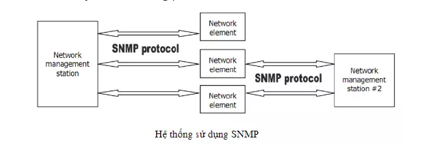
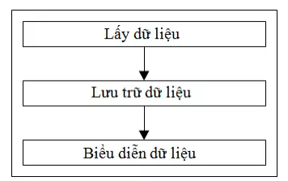

# 1. Khái niệm

- Cacti là phần mềm mã nguồn mở, giám sát mạng và công cụ đồ họa viết trên PHP/MySQL.
- Cacti sử dụng RRDTool (Round-robin database tool) mục đích lưu trữ dữ liệu và tạo đồ họa. Cacti thu thập dữ liệu định kì thông qua Net-SNMP (một bộ phần mềm dùng để thực hiện SNMP-Simple Network Management Protocol).

## 1.1 Giới thiệu SNMP (Simple Network Management Protocol)
- SNMP là tập jpưk các giao thức không chỉ cho phép kiểm tra nhằm đảm bỏa các thiết bị mạng như router, switch hay server đang vận hành mà còn vận hành một cách tối ưu, ngoài ra SNMP còn cho phpé quản lý các thiết bị từ xa  

- Ví dụ
  - Dùng SNMP để tắt một interface trên router, theo dõi hoạt đọng của card internet hoặc kiểm soát nhiệt đọ trên switch.
- Tóm lại tất cả các thiết bị có thể chạy các phần mềm cho phép lấy được thông tin SNMP đều có thể quản lý được, không chỉ các thiết bị vật lý mà còn cả các phần mềm như web server,, database

  - **Network management station**: thường là mọt máy tính chay phần mềm quản lý SNMP dùng để giám sát và điều khiển tập trung các network element
  - **Network element(device, host, application)**: là các thiết bị, máy tính hoặc phần mềm tương thích và được quản lyú bởi Network management
  - Một management station có thể quản lý được nhiều element và một element cũng có thể được quản lý bởi nhiều management
## 1.2 Giới thiệu RRDTool (Round-Robin Database Tool)
- RRDTool là  một hệ thống ghi và vẽ dữ liệu hiệu năng cao, được thiết kế xử lý dữ liệu theo chuỗi thời gian như băng thông, nhiệt độ phòng CPU load, server load và để giám sát các thiết bị như router, UPS,...Nó cho phép người quản trị ghi và phân tích dữ liệu thu thập được từ tất cả các nguồn dữ liệu.
- Việc phân tích dữ liệu của RRDTool phụ thuộc vào khả năng tạo ra các đồ thị hiển thị các giá trị thu thập được trong một khoảng thời gian định kỳ
- RRDTool được viết bởi ngôn ngữ C và lưu trữ dữ liệu của nó trong file .rrd. Số lượng bản ghi trong một file .rrd đơn không bao giờ tăng vì các bản ghi cũ sẽ thường xuyên được loại bỏ.
- Các bước trong quá trình hoạt động của RRDTool:

  **Thu thập dữ liệu**: Dữ liệu được thu thập trong khoảng thời gian cố định sẽ được lưu trong một cơ sở dữ liệu vòng
  **Hợp nhất dữ liệu**: Việc quản lý dữ liệu của nhiều thiết bị trong một khoảng thời gian lớn sẽ gây khó khăn cho người quản trị. RRDTool cung cấp cho người quản trị một số hàm chức năng: max, min, average của dữ liệu và lưu trữ vòng dữ liệu hợp nhất
  **Dữ liệu chưa biết**: khi dữ liệu không tồn tại do thiết bị bị hỏng hoặc nguyên nhân khác RRDTool sẽ lưu trữ file rrd với giá trị dữ liệu UNKNOWN
  **Vẽ đồ thị**: Cho phép người quản trị tạo ra các báo cáo ở dạng đồ thị dựa trên dữ liệu được lưu trữ trong cơ sở dữ liệu

# 2. Cơ chế hoạt động

- Cacti lấy dữ liệu thông qua poller, nó được lâp trình trong hệ điều hành.
- Để lấy dữ liệu  từ dịch vụ kết nối từ xa, cacti sử dụng SNMP, các thiết bị có sử dụng SMNP có thể sử dụngg cacti để theo dõi
- Cacti sử dụng RRDTool để lưu trữ dữ liệu. RRD là hệ thống để lưu trữ và cho biết chuỗi thời gian dữ liệu được thu gom từ các thiết bị chứa SNMP
-  Nó hợp nhất dữ liệu trước đó bằng các hàm như AVERAGE, MINIMUM, MAXIMUM
- Biểu diễn dữ liệu: Chức năng quan trọng nhất của RRDTool là tích hợp chức năng đồ họa. Cacti sử dụng chức năng này để triển khai tùy chỉnh các báo cáo đồ họa dựa vào thời gian thu thập từ các thiết bị chứa SNMP khác. Có thể có 1 hoặc nhiều thông tin trong biểu đồ, cũng có thể thêm các đặc điểm tiêu biểu khác như maximum, average, minimum.
# 3. Tính năng
- **Nguồn dữ liệu**
  - Để xử lý việc thu thập dữ liệu, cần cung cấp các đường dẫn tới dữ liệu mà người dùng muốn thêm vào , sao đó Cacti sẽ thu thập dữ liệu này và thêm vào cơ sở dữ liệu MySql / kho lưu trữ vòng robin. Nguồn dữ liệu cũng có thể được tạo, tương ứng với dữ liệu thực tế trên biểu đồ
- **Thu thập dữ liệu**
  - Cơ chế đầu vào dữ liệu cho phép người dùng xác dịnh các tập lệnh tùy chỉnh có thể được sử dụng để thu thập dữ liệu.
  -  Mỗi tập lệnh có thể chứa đối số phải điuơc nhập cho từng nguồn dữ liệu  được tạo bằng cách sử dụng tập lệnh
  - Khả năng truy cập xuất dữ liệu  bằng SNMP hoặc tập lệnh có đường dẫn.  Một poller dựa trên PHP được cung cấp để thực thi các lệnh có sẵn, truy suất dứ liệu  SNMP và cập nhập các tệp RRD.
- **Đồ thị**
  -  Khi dữ liệu được xác định (một hoặc nhiều nguồn), một đồ thị RRDTool có thể được tạo ra bằng cách sử dụng dữ liệu. 
  - Cacti cho phép sử dụng tất cả các đồ thị RRDTool mà ta có thể tưởng tượng ra bằng cách sử dụng bất kì đồ thị RRDTool chuẩn và các hàm tổng hợp. 
  - "Chế độ xem danh sách" và "chế độ xem dạng cây cho phép đăt đồ thị lên cây phân cấp  tùy thuộc vào mục đích sử dụng. Tự động nhóm các mục biểu đồ GPRINT thành AREA, STACK và LINE [1-3] để cho phép sắp xếp lại nhanh chóng các mục biểu đồ.
  - Hỗ trợ tự động đếm để đảm bảo dòng văn bản chú giải trên đồ thị 
  -  Dữ liệu đồ thị có thể được điều khiển bằng cách sử dụng các hàm toán học CDEF được xây dựng trong RRDTool. Các hàm CDEF này có thể được định nghĩa trong Cacti và có thể được sử dụng trên mỗi đồ thị. Hỗ trợ tất cả các loại mục đồ thị của RRDTool bao gồm AREA, STACK, LINE [1-3], GPRINT, COMMENT, VRULE và HRULE.
- **Quản lý người dùng** 
  - Chức năng ngời dùng được xây dựng để có thể thêm người dùng và cho phép họ quyền đối với một số chức năng nhật định trên cacti

- Các tính năng chính
  - Đồ thị không giới hạn.
  - Các thao tác dữ liệu đồ thị.
  - Nguồn dữ liệu linh hoạt.
  - Thu thập dữ liệu trên một khoảng thời gian chuẩn.
  - Tập lệnh thu thập dữ liệu tùy chỉnh.
  - Hỗ trợ SNMP tích hợp.
  - Khuôn mẫu biểu đồ.
  - Khuôn mẫu nguồn dữ liệu.
  - Khuôn mẫu thiết bị.
  - Chế độ xem dạng cây, danh sách và chế độ xem trước của dữ liệu biểu đồ.
  - Quản lý và bảo mật dựa trên người dùng và nhóm người dùng.
  - Thu thập dữ liệu từ xa.
  - Tổng hợp đồ thị.
  - Phát hiện mạng.