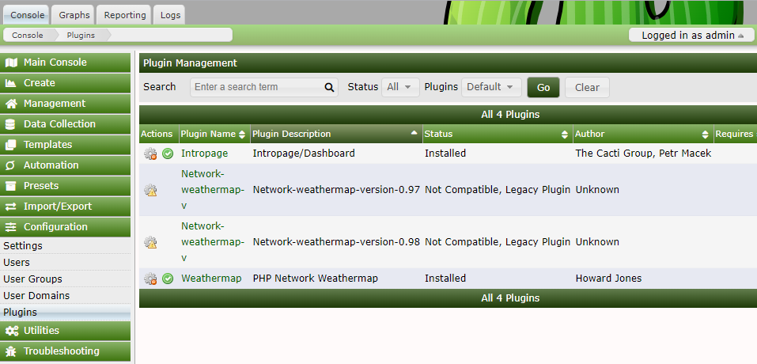
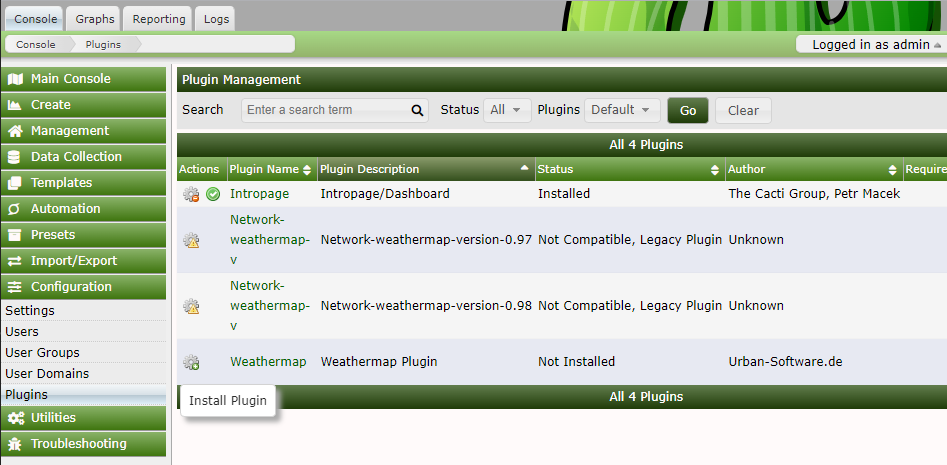
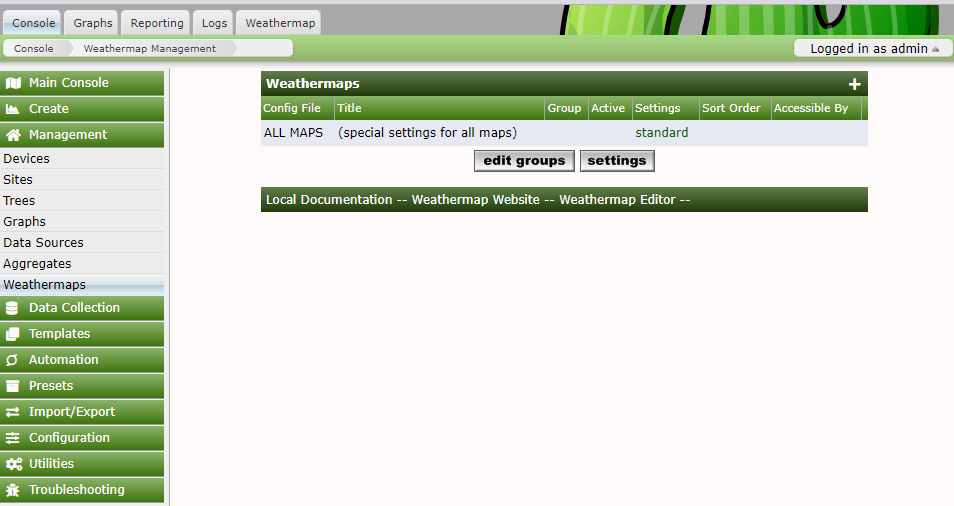

---Cài weathermap cho  cacti---

- Di chuyển đến thư mục  /usr/share/cacti/plugins
      
      cd /usr/share/cacti/plugins

- Tải file từ github

      git clone  https://github.com/thurban/plugin_weathermap.git

- Đổi tên thư mục  

      mv plugin_weathermap/ weathermap/

- Cấp quyền cho thư mục 

      chmod -R 777 plugin_weathermap/

- Truy cập cacti --> Configuration --> Plugins 

- Chọn Install plugin

- Truy cập  cacti --> Management --> Weathermaps 
 
