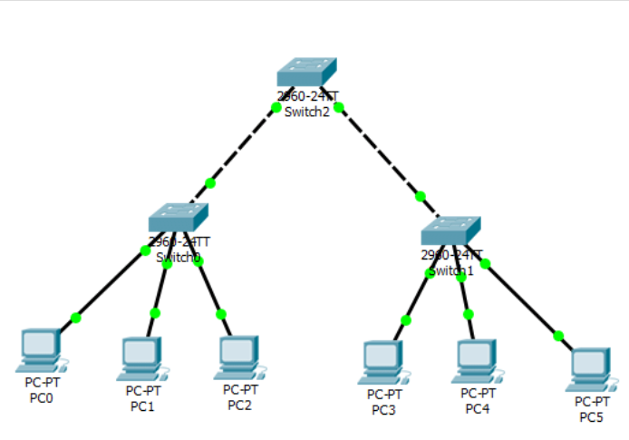
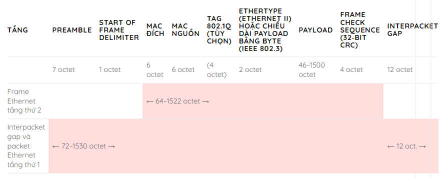
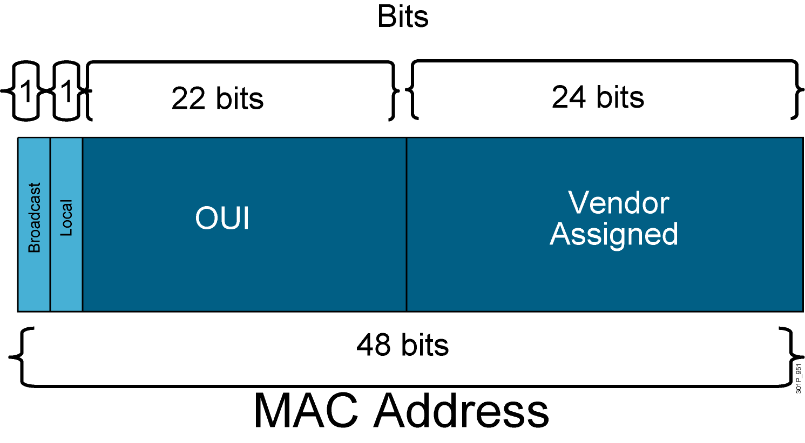

# 1. Network
## 1.1 Khái niệm

- Network là một tập hợp các máy tính, server, mainframe, thiết bị mạng, thiết bị ngoại vi hoặc các thiết bị khác được kết nối để cho phép chia sẻ dữ liệu, trao đổi tệp và giao tiếp với nhau. Các máy tính trên cùng một mạng có thể được liên kết với nhau thông qua mạng, dây cáp,…
## 1.2 Chức năng và ứng dụng 
- Chức năng chia sẻ tài nguyên trong một hệ thống mạng 
  - Chia sẻ dữ liệu và ứng dụng    
  - Chia sẻ tài nguyên
  - Lưu trữ mạng 
  - Thiết bị sao lưu
- Ứng dụng người dùng mạng 
  - Email 
  - Website
  - Database
  - Chat
- Tác động của ứng dụng người dùng
  - Batch application 
    - FPT, TFPT, inventory update
    - 2 thiết bị giao tiếp với nhau mà Không có tác động của con người
    - Băng thông quan trọng nhưng không quá cấp thiết
  - interactive application 
    - inventory update, database update
    - Có sự tương tác giữa người với máy  
    - Thời gian chờ quan trọng nhưng không quá cấp thiết      
  - real time application
    - VoIP, video 
    - Người với người  
    - Độ trể càng nhỏ càng tốt  
- Đặc tính kỹ thuật  
  - Speed: tốc độ đường truyền  
  - Cost: chi phí xây dựng hệ thống
  - Security:  tính bảo mật của mạng đảm bảo sự an toàn của đường truyền  
  - Availability: tính sẵn sàng của mạng, nên có đường mạng dự phòng  
  - Scalability: khả năng mở rộng của mạng 
  - Reliability: Độ tin cậy của đường truyền
  - Topology: sơ đồ mạng 

## 1.3 type topology
- **Physical topology**
  - là cách đấu nối các thiết bị trong mạng với nhau  

  - Các loại topology bao gồm như: ring, bus, tree, mesh, line, star, fully connected 

    - *Star Topology*: Mạng hình sao (Star Topology) là một mô hình mạng bao gồm một thiết bị làm trung tâm và các nút thông tin chịu sự điều khiển của trung tâm đó. Các nút thông tin ở đây có thể là các máy trạm, các thiết bị đầu cuối hay các thiết bị khác trong hệ thống LAN. 
    - *Bus Topology*: Đây là một kiểu Topology mà tất cả các thiết bị như máy chủ, máy trạm, các nút thông tin đều được liên kết với nhau trên một đường dây cáp chính để truyền dữ liệu. Phía hai đầu dây cáp được bịt kín bằng hai thiết bị terminator. Các dữ liệu và tín hiệu truyền qua dây cáp đều mang theo địa chỉ cụ thể của điểm đến
    - *Ring Topology*: Đây là một kiểu Topology nơi các thiết bị được kết nối thành một vòng tròn khép kín thông qua dây cáp. Tín hiệu truyền sẽ được truyền đi theo một chiều cố định nào đó. Tại một thời điểm, chỉ có một thiết bị (một nút) được truyền tin qua một nút khác. Dữ liệu khi được truyền đi trong hệ thống mạng này phải kèm theo địa chỉ cụ thể của trạm tiếp nhận nó. Ngoài ra còn có kiến trúc vòng kép(2 vòng ngược nhau)  
    - *Mesh Topology*: Mạng dạng lưới là kiểu Topology mà trong đó mỗi một máy tính sẽ được liên kết với tất cả các máy còn lại trên hệ thống mà không cần phải nối qua Hub hay Switch. Nó cũng giống như cấu trúc của mạng internet hiện nay.
    - *Mạng hình sao mở rộng*: Khác với các mô hình mạng kể trên, mạng hình sao mở rộng là sự kết hợp giữa các mạng hình sao với nhau, thông qua việc kết nối các HUB hoặc Switch. Ưu điểm của mạng hình sao mở rộng chính là có thể gia tăng khoảng cách hay độ lớn của mạng hình sao.

- **logical topology**
  - là con đường di chuyển dữ liệu trong mạng  

## 1.4 Các dạng kết nối đến internet 
- Modem điện thoại: Modem này được sử dụng cùng với đường dây điện thoại để truy cập Internet. Tốc độ rất chậm chỉ khoảng 56 kbps
- DLS: Một modem số thuê bao số (DSL) là một thiết bị được sử dụng để kết nối máy tính hoặc bộ định tuyến với một đường dây điện thoại cung cấp dịch vụ đường dây thuê bao kỹ thuật số để kết nối Internet, thường được gọi là băng rộng DSL.
- Cáp modem: Dịch vụ cáp thường được cung cấp bởi các công ty truyền hình cáp thông qua modem cáp và đường dây cáp có sẵn. Tốc độ cao hơn so với ADSL
- CSU/DSU: CSU/DSU (Channel Service Unit/Data Service Unit) là một thiết bị phần cứng có kích thước tương đương với một modem cắm ngòai, nó có khả năng chuyển đổi các khung dữ liệu dùng trong mạng LAN sang dạng dữ liệu tương thích với đường truyền mạng WAN và ngược lại
  - Channel Service Unit (CSU) là bộ truyền và nhận tín hiệu trên các đường truyền WAN, nó cũng cung cấp cơ chế chống nhiễu(hoặc giao thoa) từ cả 2 đầu của thiết bị. CSU cũng làm nhiệm vụ phản hồi tín hiệu loopback kiểm tra từ telco.
  - Data Service Unit (DSU) là bộ phận có khả năng quản lý việc điều khiển đường truyền và chuyển đối các tín hiệu vào ra giữa các chuẩn đóng khung tín hiệu RS232C, RS-449, hay V.xx của mạng LAN với khung dữ liệu được xây dựng theo cơ chế phân kênh theo thời gian (time-division multiplexed (TDM)) của đường T1 DSx (DS0,DS1,..vv…). DSU giám sát và quản lý các lỗi do không đồng bộ thời gian và thực hiện viêc tái tạo tín hiệu. DSU cung cấp giao diện tương tự như modem giữa computer (đóng vai trò là DTE) với thiết bị CSU.

# 2. Ethernet LAN
## 2.1  Mạng LAN là gì?
- LAN là viết tắt của Local Area Network tạm dịch là mạng máy tính nội bộ, giao tiếp này cho phép các máy tính kết nối với nhau để cùng làm việc và chia sẻ dữ liệu. Kết nối này được thực hiện thông qua sợi cáp LAN hoặc Wifi (không dây) trong không gian hẹp, chính vì thế nó chỉ có thể sử dụng được trong một phạm vi giới hạn như phòng làm việc, trong nhà, trường học… 
- Các thiết bị sử dụng  cổng kết nối cáp mạng RJ45 (Ethernet) để kết nối với nhau  
## 2.2 Thành phần mạng LAN
- Máy tính 
  - PC 
  - Server
- Kết  nối mạng
  - NICs( Network Interface Card) hay còn gọi là card giao tiếp mạng là một thiết bị phần cứng được cài đặt trên máy tính để nó có thể được kết nối với internet. Mỗi NIC đều có một số sê-ri 48-bit duy nhất được gọi là địa chỉ MAC được lưu trữ trong ROM mang trên thẻ. Mỗi máy tính phải có ít nhất một NIC nếu nó muốn kết nối với internet.
  - Media: là phương tiện truyền dẫn như các đoạn dây cáp 
- Thiết bị mạng
  - Hubs
  - Switches
  - Router
- Protocals
  - ethernet 
  - IP 
  - ARP
  - DHCP
## 2.3 Chức năng
- Chia sẻ dữ liệu và ứng dụng  
- Chia sẻ tài nguyên  
- Cung cấp kết nối đến một mạng khác  

## 2.4 Lan Size 
- Soho lan (smaill office, home office)là một mạng lan có kích thước rất nhỏ  
- Entherprise LAN: được sử dụng trong một mô hình lớn như ở trong các công ty, doanh nghiệp 
## 2.5 Các chuẩn của mạng LAN

- TRong mô hình OSI, các chuẩn mạng lan tập trung ở 2 lớp là physical layer và data link layer(LLC Sublayer và MAC Sublayer).

  - LLC Sublayer chuyên giao tiếp với các hệ thống layer 3  
  - MAC Sublayer điều kiểu việc truy nhập vào đường truyền vật lý  
## 2.6 Cấu trúc khung của Ethernet 
- Một packet data (gói dữ liệu) trên một link Ethernet được gọi là một packet Ethernet. Frame Ethernet là payload (phần tải mang theo) do packet này vận chuyển.
- Cấu trúc frame và packet Ethernet 802.3:

  - Một frame Ethernet có một preamble và một start frame delimiter (SFD) đi đầu, cả hai đều là một phần của packet Ethernet ở tầng vật lý.
  - Mỗi frame Ethernet bắt đầu bởi một header Ethernet. Header này chứa địa chỉ MAC nguồn và đích ở hai trường đầu tiên.
  - Phần ở giữa frame là data payload chứa các header bất kì của các protocol khác (ví dụ, Internet Protocol) được mang trong frame này.
  - Frame kết thúc bởi một frame check sequence (FCS, chuỗi kiểm tra frame). Đây là một cyclic redundancy check 32 bit được dùng để phát hiện bất kì hư hỏng dữ liệu nào trong lúc truyền.
  - Tag 802.1Q (tùy chọn) chiếm không gian phụ thêm bên trong frame. Các kích thước trường cho tùy chọn này được chỉ ra trong dấu ngoặc đơn ở bảng phía trên. IEEE 802.1ad (Q-in-Q) cho phép có nhiều tag trong một frame. Tùy chọn này không được minh họa ở đây.
  - Interpacket gap là khoảng thời gian nhàn rỗi giữa hai packet. Sau khi một packet đã được gửi đi, các transmitter cần phải truyền ít nhất 96 bit (12 octet) của idle line state (trạng thái dây rảnh) trước khi truyền packet tiếp theo.
- Có nhiều kiểu frame Ethernet:
  - Frame Ethernet II, hoặc Ethernet Version 2, hoặc frame DIX là một kiểu thông dụng nhất hiện nay vì nó thường được dùng trực tiếp bởi Internet Protocol.
  - Frame biến hóa phi tiêu chuẩn IEEE 802.3 thô của công ty Novell
  - Frame Logical Link Control (LLC) IEEE 802.2
  - Frame Subnetwork Access Protocol (SNAP) IEEE 802.2

- Các kiểu frame khác nhau có các định dạng và các giá trị MTU khác nhau, nhưng có thể cùng tồn tại trên cùng một medium vật lý,
- Chỉ số MTU rất quan trong khi giao tiếp giữa 2 thiết bị, giá trị MTU cần phải giống nhau.
- Sự khác biệt của các loại ethernet frame

## 2.7 Địa chỉ MAC
### 2.7.1 MAC
- MAC là viết tắt của từ Media Access Control. Đây chính là một phần của tầng liên kết trong mô hình 7 tầng OSI. Trong tầng liên kết của mô hình OSI lại được chia thành hai tầng con đó là tầng Mac và tầng LLC.
- Chức năng chính của Mac là cung cấp các cơ chế đánh địa chỉ và điều khiển truy cập kênh. Nghĩa là tầng con Mac trong tầng liên kết được hoạt động giống như một giao diện giúp việc truyền dữ liệu giữa tầng con LLC với tầng vật lý trong mô hình OSI được diễn ra thuận lợi. Ngoài ra, Mac còn có tác dụng cho phép nhiều trạm kết nối tới cùng một môi trường vật lý và dùng chung môi trường đó.

### 2.7.2 Địa chỉ MAC
- Địa chỉ MAC là một dãy số 48-bit được nhà sản xuất card mạng nhúng vào và là địa chỉ duy nhất và không thể thay đổi được. Địa chỉ MAC được ví là địa chỉ vật lý của thiết bị mạng tương tự như việc muốn đi đến nhà nào cũng phải biết địa chỉ của nhà đó
- Địa chỉ Mac gồm 6 octets(thường là 6 byte hoặc 48 bit), mỗi octets 8 bits, được biểu diễn bằng 6 cặp chữ số hoặc ký tự khác nhau và được ngăn cách bằng dấu hai chấm. ví dụ  `00:1B:44:11:3A:B7`
- Địa chỉ Mac thường có 3 loại đó là Unicast, Broadcast, Multicast. 

  - Unicast: Địa chỉ Unicast MAC luôn được sử dụng cho máy nguồn. Đây là địa chỉ mà nó chỉ được gửi đến một card mạng cụ thể. Nếu LSB (bit ít quan trọng nhất) của octet đầu tiên của một địa chỉ được đặt thành 0, thì địa chỉ Mac này chỉ tiếp cận một card mạng nhận.  

  - Multicast: Địa chỉ Multicast cho phép gửi đến nhóm thiết bị.
  Thiết bị gửi đi  chứa thông tin IP của nhóm máy chủ. Các máy chủ ở trong nhóm sẽ so sánh địa chỉ ip trong frame có trong danh sách địa chỉ ip. Nếu có trong danh sách sẽ phản hồi lại. Ngược lại sẽ không phản hồi. Trong địa chỉ Multicast Lớp-2 (Ethernet), LSB (bit ít quan trọng nhất) của octet đầu tiên của một địa chỉ được đặt thành 1. IEEE sẽ cấp các địa chỉ 01-80-C2-xx-xx-xx (01-80-C2-00-00-00 đến 01-80-C2-FF-FF-FF) cho các địa chỉ nhóm để kết nối với nhau.

  - Broadcast: Địa chỉ Broadcast cho phép các khung Ethernet có tất cả các bit của địa chỉ đến (FF-FF-FF-FF-FF-FF). Các khung có địa chỉ MAC FF-FF-FF-FF-FF-FF (địa chỉ broadcast) sẽ đến được với mọi máy tính thuộc phân đoạn mạng LAN đó. Máy tính có nhận được khung sẽ so sách địa chỉ ip trong frame với địa chỉ ip của máy, Nếu trùng sẽ gửi lại frame chứa địa chỉ MAC của máy về máy tính gửi.

- Địa chỉ này là duy nhất được các nhà sản xuất gắn cho từng phần cứng của các thiết bị và không thể thay đổi được. Mỗi thiết bị sẽ có một địa chỉ MAC khác nhau và duy nhất. Vì vậy mà địa chỉ Mac hay còn được gọi là địa chỉ phần cứng hoặc địa chỉ thực. 
- **Định dạng**
  - Địa chỉ MAC là một dãy số hexadecimal (hệ thập lục phân) 12 ký tự có thể là chữ, chữ số hoặc một ký tự đặc biệt nào đó. Trong đó 6 ký tự đầu tiên là những ký tự địa chỉ MAC định danh nhà sản xuất thiết bị đó, gọi là OUI (Organizational Unique Identifier), 6 ký tự bên phải đại diện cho card mạng, được gán bởi nhà sản xuất.

  - Ví dụ về các ký tự định danh nhà sản xuất thiết bị mạng:

    - CC:46:D6 - Cisco 
    - 3C:5A:B4 - Google Inc.
    - 3C:D9:2B - Hewlett Packard
    - 00:9A:CD - HUAWEI TECHNOLOGIES CO.,LTD

# Tham khảo 
- https://vnpro.vn/thu-vien/tong-quan-ve-ethernet-frame-va-mac-address-4326.html
- https://ladigi.vn/frame-ethernet-la-gi-chi-tiet-ve-frame-ethernet-moi-nhat-2021

    