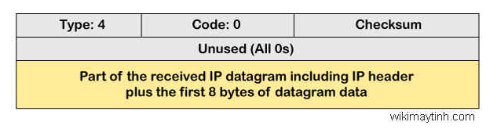
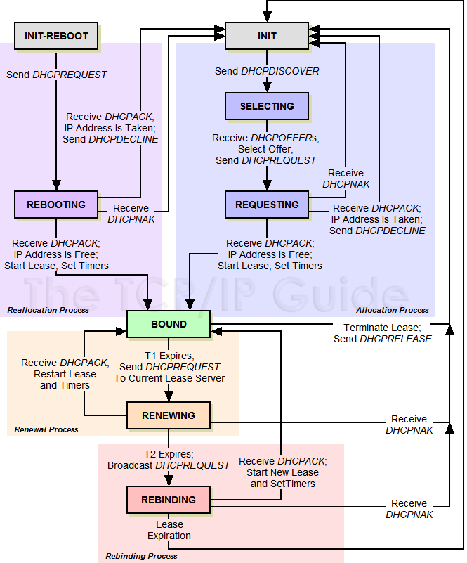

# 1. ICMP
- Giao thức ICMP ( Internet Control Message Protocol) là một giao thức lớp mạng được các thiết bị mạng sử dụng để phát hiện các sự cố truyền thông mạng
- ICMP chủ yếu được sử dụng để xác định dữ liệu có đến đích như dự kiến một cách kịp thời hay không. Thông thường, giao thức ICMP được sử dụng trên các thiết bị mạng, chẳng hạn như bộ định tuyến.
- ICMP rất quan trọng để báo cáo lỗi và kiểm tra, nhưng nó cũng có thể được sử dụng trong các cuộc tấn công từ chối dịch vụ phân tán (DDoS).

- ICMP nằm trong lớp IP, như thể hiện trong sơ đồ bên dưới.

- Bản tin của ICMP được chia thành 2 loại
  - Bản tin báo lỗi: Gồm các yêu cầu nguôn dừng lại, hết thời gian chờ gói IP không đến được đích, yêu cầu định tuyến lại và yêu cầu phân mảnh.
  - Bản tin trao đổi thông tin: yêu cầu trả lời và đáp ứng, yêu cầu cung cấp địa chỉ mặt lạ và đáp ứng, yêu cầu bộ định tuyến 
- Định dạng bản tin ICPM  

  - Type: Đây là trường 8 bit. Nó xác định loại tin nhắn ICMP. Các giá trị từ 0 đến 127 được xác định cho ICMPv6 và các giá trị từ 128 đến 255 là các thông báo cung cấp thông tin. 
  - Code: Đây là trường 8 bit xác định loại phụ của thông báo ICMP  
  - Checksum: Nó là một trường 16 bit để phát hiện xem lỗi có tồn tại trong thông báo hay không.
  - **Lưu ý**: Giao thức ICMP luôn báo cáo các thông báo lỗi đến nguồn ban đầu. Ví dụ, khi người gửi gửi tin nhắn, nếu có bất kỳ lỗi nào xảy ra trong tin nhắn thì bộ định tuyến sẽ báo cáo cho người gửi chứ không phải người nhận vì người gửi đang gửi tin nhắn.

- Các loại bản tin báo lỗi  

     Type | mô tả 
    ---|---
    0 | Trả lời cho type=8
    3| không thể tới đích
    4  | nguồn chậm lại
    5| định tuyến lại
    8| yêu cầu trả lời  
    11| hết thời gian  
    12 | không hiểu tham số  
    13 | yêu cầu cung cấp thời gian  
    14 | trả lời cung cấp thời gian  
    15|yêu cầu  cung cấp thông tin 
    16| trả lời cung cấp thông tin 
    17 |yêu cầu cung cấp mặt nạ
    18 | trả lời cung cấp mặt nạ

    - **Code**: là một số 4 bit xác định xem thông báo đến từ bộ định tuyến trung gian hay chính đích đenws 
  
    code| mô tả 
    ---|---
    0 | Không tới được mạng do không có đường tới  
    1| không tới được máy do không có kết nối trực tiếp  
    2 | Không tới được giao thức (lớp truyền tải)
    3| không tới được cổng(lớp ứng dụng)
    4| cần phân mảnh nhưng cờ DF=1
    5 | bộ định tuyến nguồn bị lỗi  
    6| Không biết mạng địch 
    7 | không biết máy đích  
    8 | máy nguồn bị cách ly 
    9 | truyền thông với mạng đích bị admin ngăn cấm 
    10| truyền thông với máy đích bị admin ngăn cấm
    11| Không tới được mạng do loại dịch  vụ  
    12| không tới được máy do loại dịch vụ  

  - *Destination unreachable (Điểm đến không thể truy cập)* Lỗi không thể truy cập được đích xảy ra khi gói tin không đến được đích. Giả sử người gửi gửi tin nhắn, nhưng tin nhắn không đến được đích, khi đó bộ định tuyến trung gian báo cáo với người gửi rằng không thể truy cập được đích.

    - **Type**: Xác định loại bản tin. 

  - *Source quench (tắc nghẽn nguồn)*:  Khi bộ định tuyến bị nghẽn (hoặc host đích bị tràn) nó gửi thông báo về nguồn cho từng gói ip bị tràn. Nhận được bản tin này, máy nguồn giảm tần suất gửi gói IP cho tới khi không còn nhận được thông báo lỗi. Sau đó nó sẽ tăng dần tần suất gửi gói tin. Bản tin này có type= 4 và chỉ có 1 code=0 

  - *Time exceeded(đã vượt quá thời gian)*:Được sử dụng khi giá trị TTL=0 nhưng gói tin IP vẫn chưa tới đich (code=0) hoặc hết thời gian chờ để tái hợp (code =1) 

  - *Các vấn đề về tham số*:  Bộ định tuyến và máy chủ đích  có thể gửi thông báo về vấn đề tham số. Thông báo này truyền tải một tham số không được đặt đúng  

- ICMP được sử dụng trong tấn công DDoS
  - Tấn công ICMP flood
  - Tấn công Ping
  - Tấn công Smurf

# 2. ARP
- ARP (Address Resolution Protocol) là giao thức mạng được dùng để tìm địa chỉ phần cứng (địa chỉ MAC) của thiết bị từ một địa chỉ IP. ARP đã được thực hiện với nhiều kết hợp của công nghệ mạng và tầng liên kết dữ liệu, như IPv4, Chaosnet,…
- Cơ chế hoạt động
  - Ta có sơ đồ mạng dưới đây

  - Giả sử PC1 muốn giao tiếp với PC2, PC1 biết địa chỉ IP của PC2, sử dụng dịch vụ FTP (File Transfer Protocol), gói tin gửi từ PC1 sẽ phải bao gồm dữ liệu qua 4 lớp dựa trên mô hình tham chiếu TCP/IP trong đó Lớp Network access là kết hợp Lớp Data Link và Physical trong mô hình OSI, được biểu diễn như sau:

  -  PC1 lúc này không biết địa chỉ MAC của PC2. Để tìm được địa chỉ MAC của PC2, thì PC1 phải gửi ARP Request. Khi PC2 nhận được, PC2 sẽ trả lời bằng gói tin ARP Reply, chứa thông tin về địa chỉ MAC của PC2.
    - Nếu Destination IP cùng subnet với Source IP thì ARP sẽ tìm địa chỉ MAC của chính IP đó.
    Nếu Destination IP khác subnet với Source IP thì ARP sẽ tìm địa chỉ MAC của Default Gateway.
  - Trong sơ đồ mạng bên trên, Destination IP cùng subnet với Source IP. Như vậy ARP sẽ tìm địa chỉ MAC của chính IP 192.168.1.11
  - Bảng so sánh chức năng của gói tin ARP Request và gói tin ARP Reply: 

    ARP Request | ARP Reply
    ---|---
    Là gói tin mà máy gửi gửi broadcast để tìm địa chỉ MAC của máy nhận.|Là gói tin mà máy nhận sau khi nhận được ARP request sẽ đóng gói lại MAC của mình và gửi gói tin reply về cho máy gửi.
    Là gói tin Broadcast|Là gói tin Unicast
    Nội dung : tìm địa chỉ MAC của một địa chỉ IP|Nội dung : thông tin địa chỉ MAC của địa chỉ IP tương ứng

- Ngoài loại ARP nêu trên, còn có 4 loại ARP khác, bao gồm:

  - *Proxy ARP*: là một kỹ thuật bắt buộc thiết bị proxy trong một mạng phải trả lời cho ARP không có địa chỉ IP trên mạng đó. Proxy có khả năng nhận biết vị trí đích của lưu lượng truy cập và cung cấp địa chỉ MAC của chính mình làm đích.
  - *Gratuitous ARP*: gần giống như thủ tục hành chính và thực hiện trên máy chủ. Hoạt động này chỉ nhằm thông báo một địa chỉ IP to MAC đã được cập nhật. Gratuitous ARP không thể nhắc dịch hoặc thực hiện ARP request từ một IP sang MAC.
  - *Reverse ARP*: Máy chủ của bạn sẽ không biết địa chỉ IP của chính bản thân chúng nhưng chúng có thể sử dụng Reverse Address Resolution Protocol (RARP) để tự khám phá địa chỉ của mình.
  - *Inverse ARP*: ARP sử dụng địa chỉ IP để tìm địa chỉ MAC. Trong khi đó, Inverse ARP sử dụng địa chỉ MAC để tìm địa chỉ IP.

- Có 4 loại địa chỉ nằm trong một bản tin ARP  đó là:

  - *Sender Hardware Address*: Đây là địa chỉ lớp hai của thiết bị gửi bản tin

  - *Sender Protocol Address*: Đây là địa chỉ lớp ba (hay còn gọi là địa chỉ logic) của thiết bị gửi bản tin

  - *Target Hardware Address*: Địa chỉ lớp hai (hay còn được gọi là địa chỉ phần cứng) của thiết bị đích của bản tin

  - *Target Protocol Address*: Địa chỉ lớp ba (hay gọi là  địa chỉ logic) của thiết bị đích của bản tin

- Lợi ích của ARP
  - Nhờ có ARP, thì địa chỉ MAC có thể dễ dàng được biết nếu bạn biết địa chỉ IP của cùng một hệ thống. Mục tiêu của ARP là cho phép từng máy chủ lưu trữ trên mạng cho phép bạn tạo ánh xạ giữa địa chỉ IP và địa chỉ MAC. Tập hợp các ánh xạ hoặc bảng được lưu trữ được gọi là bảng ARP hoặc ARP cache.

# 3. DHCP
- DHCP (Dynamic Host Configuration Protocol) là một giao thức được sử dụng để cung cấp quản lý nhanh chóng, tự động và tập trung cho việc phân phối địa chỉ IP trong mạng. Nó cung cấp cho máy tính địa chỉ ip ; subnet mask; default gateway. Và nó thường được cấp phát bởi DHPC server được tích hợp sẵn trên router
## Đặc điểm
- Cũng làm việc theo mô hình Client/Server.

- Sử dụng cổng đặc biệt cho DHCP server là cổng 67. Các DHCP server lắng nghe trên cổng 67 cho các bản tin broadcast request được gửi bởi client. Sau khi xử lý bản tin request, server gửi một bản tin reply lại cho client.

- Các DHCP client lắng nghe bản tin reply lại từ DHCP server trên cổng 68.
- Chức năng
  - Mỗi thiết bị trên mạng cơ sở TCP/IP phải có một địa chỉ IP duy nhất để truy cập mạng các các tài nguyên của nó. Không có DHCP, cấu hình IP phải được thực hiện một các thủ công cho các máy tính mớ, các máy tính di chuyển từ mạng con này sang mạng con khác, và các máy tính đợc lại bỏ khỏi mạng.

  - Bằng việc phát triển DHCP trên mạng, toàn bộ tiến trình này được quản lý tự động và tập trung. DHCP server bảo quản vùng của các địa chỉ IP và giải phóng một địa chri với bất cứ DHCP client có theer khi nó có thể ghi lên mạng. bởi vì các địa chri IP là động hơn tĩnh, các địa chri không còn được trả lại một cách tự động trong sử dụng đối với các vùng cấp phát lại.

- Ưu điểm khi sử dụng DHCP

  - Tập trung quản trị thông tin cấu hình host
  - Cấu hình động các máy
  - Cấu hình IP cho các máy một cách liền mạch.
  - Khả năng mở rộng
  - Đơn giản hóa vài trò quản trị của việc cauas hình địa chỉ IP của client.
  - Sự linh hoạt

## Hoạt động cơ bản của DHCP

- Bước 1 : Khi một thiết bị mạng chưa có địa chỉ IP hoặc địa chỉ IP hết hạn thuê , nó sẽ tiến hành xin địa chỉ IP bằng cách gửi gói tin DHCP Discover dạng Broadcast lên toàn mạng để tìm DHCP server, DHCP Discover chứa địa chỉ MAC và tên máy tính hoặc chứa địa chỉ IP đã thuê trước đây

- Bước 2: Các máy chủ DHCP Server trong mạng điều nhận được thông điệp DHCP Discover, nếu DHCP server có cấu hình hợp lệ cho máy client nó chuẩn bị thông điệp DHCP Offer chứa địa chỉ Mac của máy tính, địa chỉ ip, Subnet mask, địa chỉ gateway, DNS ….nó sẽ đánh dấu địa chỉ này là “reserve” và hồi đáp một gói DHCP Offer dạng Broadcast  lên mạng

- Bước 3: Khi client khi nhận được DHCP Offer đến đầu tiên và nếu chấp nhận địa chỉ đó thì nó sẽ trả lời lại cho DHCP server một thông điệp DHCP Request dạng broadcast để xác định là chấp nhận địa chỉ mà DHCP server đề nghị

- Bước 4: DHCP server gửi lại thông điệp DHCP Acknowledgment để xác nhận cấu hình IP với client.

Chú ý: Khi khi client xin DHCP thì gửi gói tin dạng Broatcast thì tất cả các DHCP server điều nhận được do đó có thể có nhiều DHCP Server gửi thông điệp DHCP Offer. Máy client chỉ chấp nhận một thông điệp DHCP Offer hợp lệ đầu tiên, sau đó gửi thông điệp DHCP Request khẳng định lên mạng vì thông điệp này được phát tán dạng Broadcast nên mọi DHCP server điều nhận được. Thông điệp này chứa địa chỉ ip của DHCP Server vừa cho thuê, vì thế các DHCP server khác sẽ rút lại thông điệp và hoàn trả địa chỉ ip vào vùng địa chỉ để dành

## Cơ chế phân giải bổ địa chỉ của DHCP server

- 2 chức năng chính của DHCP là cung cấp một cơ chế gán địa chỉ cho các máy host và phương thức mà client có thể yêu cầu một địa chỉ IP và các thông tin cấu hình cho nó từ server. 

DHCP gồm 3 cơ chế phân bổ địa chỉ khác nhau:

- **Manual Allocation:** Một địa chỉ IP cụ thể được cấp phát trước cho một thiết bị duy nhất bởi người quản trị. DHCP chỉ truyền IP tới các thiết bị đó (hiểu như là server, router, gateway, ... ). Nó cũng thích hợp cho các thiết bị khác mà vì lý do gì phải có một địa chỉ IP cố định ổn định.

- **Automatic Allocation:** DHCP tự động gán một địa chỉ IP vĩnh viễn với một thiết bị, chọn từ một pool IP có sẵn. Sử dụng trong trường hợp có đủ địa chỉ IP cho mỗi thiết bị có thể kết nối vào mạng, nhưng mà thiết bị không thực sự cần quan tâm đến địa chỉ mà nó sử dụng. Khi một địa chỉ được gán cho một client, thiết bị sẽ tiếp tục sử dụng nó. Automatic Allocation được coi là một trường hợp đặc biệt của Dynamic Allocation – dùng trong trường hợp các giới hạn thời gian sử dụng các địa chỉ IP của một client gần như là “mãi mãi”.

- **Dynamic Allocation:** DHCP gán một địa chỉ IP từ một pool các địa chỉ trong một khoảng thời gian hạn chế được lựa chọn bởi server, hoặc cho đến khi client nói với DHCP server là nó không cần địa chỉ này nữa. 

  -	Server sẽ quyết định số lượng thừi gian mà hợp đồng cho thuê IP sẽ kéo dài. Khi hết thời gian, client hoặc phải xin phép tiếp tục sử dụng các địa chỉ (đổi mới thuê) hoặc phải có được một cấu hình mới. 

  -	Phương pháp này cung cấp nhiều lợi ích như: 

      - *Automation*: mỗi client có thể được tự động gán IP khi nó cần mà không cần tới sự can thiệp của người quản trị viên để quyết định địa chỉ cho client đó.

      - *Quản lý tập trung*: tất cả các IP được quản lý bởi DHCP server. Người quản trị có thể dễ dàng tìm tháy những thiết bị đang sử dụng mà giải quyết và thực hiện nhiệm vụ bảo trì mạng.

      - *Tái sử dụng và chia sẻ địa chỉ IP*: bằng cách giới hạn thười gian mà mỗi client được phép thuê IP, DHCP server có thể đảm bảo rằng các pool IP chỉ được sử dụng bởi các thiết bị đang hoạt động. Sau một khoảng thời gian, IP nào không được sử dụng nữa sẽ được trở về lại pool để cho phép các client khác sử dụng chúng. Điều này cho phép một liên mạng để hỗ trợ một số lượng thiết bị lớn hơn số địa chỉ IP sẵn có, miễn là tất cả các thiết bị kết nối mạng cùng lúc. 

      - *Khả năng di chuyển giữa các mạng*: với việc dynamic allocation, không có sự phân bổ địa chỉ IP nào được xác định trước, do đó bất kỳ client nào đều có thể yêu cầu một IP. Điều này làm cho nó trở thành một lựa chọn lý tưởng cho việc hỗ trợ các thiết bị di động và di chuyển giữa các mạng.

      - *Tránh các vấn đề xung đột*: Vì địa chỉ IP đều được xác định từ một pool và quản lý bởi máy chủ DHCP nên việc xung đột IP là có thể tránh được.

    - Đây là cơ chế được sử dụng nhiều nhất trong các mô hình mạng hiện nay.

## Vòng đời và thời gian "thuê" địa chỉ IP của client

- Khi một client được thiết lập để sử dụng DHCP, nó sẽ không bao giờ có quyền hạn sở hữu IP đó lâu dài. Mỗi lần có quyền hạn sử dụng, nó phải thỏa thuận liên kết với một DHCP server để bắt đầu hoặc xác nhận thuê một IP. Nó cũng phải thực hiện các hoạt động khác theo thời gian để quản lý việc thuê địa chỉ này và có thể chấm dứt nó.

- Vòng đời thuê IP của DHCP gồm các bước sau:

  - **Allocation:** Một client bắt đầu khi chưa từng thuê IP và do đó chưa có địa chỉ được cấp từ DHCP server. Nó yêu cầu thuê thông qua một quá trình phân bổ Allocation.

  - **Reallocation**: Nếu client đã có sẵn địa chỉ IP lần thuê hiện tại, và sau đó khi nó khởi động lại sau khi tắt, nó sẽ liên lạc với DHCP server để xác nhận việc thuê và dùng lại các thông số vận hành. Điều này được gọi là Reallocation, nó tương tự như Allocation nhưng ngắn hơn.

  - **Normal Operation:** Khi một hợp đồng cho thuê đang hoạt động, client được gán vào một địa chỉ mà DHCP server cấp phát, cho thuê.

  - **Renewal**: Sau một phần thời gian nhất định của thời gian cho thuê, client sẽ cố gắng liên lạc với máy chủ cho thuê ban đầu, gia hạn thêm hợp đồng để nó có thể tiếp tục sử dụng IP đó sau khi thời gian cho thuê kết thúc (thường sau nửa thời gian được phép sử dụng IP, client sẽ liên lạc với DHCP server để gia hạn thêm hợp đồng)

  - **Rebind:** Nếu việc renewal không thành (giả sử máy server bị tắt), sau đó client sẽ cố gắng kết nối lại với bất kì máy chủ DHCP nào đang hoạt động, cố gắng mở rộng thời gian cho thuê hiện tại.

  - **Release:** client có thể quyết định ở bất kì thời điểm nào đó nó không còn muốn sử dụng địa chỉ IP được cấp từ DHCP nữa, và có thể chấm dứt hợp đồng cho thuê, giải phóng địa chỉ IP. 

##  Các loại bản tin DHCP
- Quá trình hoạt động của DHCP và FSM của client:

-	**DHCP DISCOVER**: Ban đầu, một máy tính DHCP Client muốn gia nhập mạng, nó yêu cầu thông tin địa chỉ IP từ DHCP Server bằng cách gửi broadcast một gói DHCP Discover. Địa chỉ IP nguồn trong gói là 0.0.0.0 bởi vì client chưa có địa chỉ IP.

-	**DHCP OFFER**: Mỗi DHCP server nhận được gói DHCP Discover từ client đáp ứng với gói DHCP Offer chứa địa chỉ IP cho thuê và thông tin định cấu hình TCP/IP bổ sung(thêm vào), chẳng hạn như subnet mask và gateway mặc định. Nhiều hơn một DHCP server có thể đáp ứng với gói DHCP Offer. Client sẽ chấp nhận gói DHCP Offer đầu tiên nó nhận được.

-	**DHCP REQUEST:** Khi DHCP client nhận được một gói DHCP Offer, nó đáp ứng lại bằng việc broadcast gói DHCP Request mà chứa yêu cầu địa chỉ IP mà server cung cấp trong bản tin offer - thể hiện sự chấp nhận của địa chỉ IP được yêu cầu từ một server xác định.

-	**DHCP ACK:**  DHCP server được chọn lựa chấp nhận DHCP Request từ Client cho địa chỉ IP bởi việc gửi một gói DHCP Acknowledge (ACK). Tại thời điểm này, Server cũng định hướng bất cứ các tham số định cấu hình tuỳ chọn. Sự chấp nhận trên của DHCP Acknowledge, Client có thể tham gia trên mạng TCP/IP và hoàn thành hệ thống khởi động. (Bản tin này gần như giống nội dung bản tin OFFER)

-	**DHCP NAK:** Nếu địa chỉ IP không thể được sữ dụng bởi client bởi vì nó không còn giá trị nữa hoặc được sử dụng hiện tại bởi một máy tính khác, DHCP Server đáp ứng với gói DHCP Nak, và Client phải bắt đầu tiến trình thuê bao lại. Bất cứ khi nào DHCP Server nhận được yêu cầu từ một địa chỉ IP mà không có giá trị theo các Scope mà nó được định cấu hình với, nó gửi thông điệp DHCP Nak đối với Client.

-	**DHCP DECLINE:** Khi client nhận được thông tin cấu hình từ DHCP server, nhưng có thể xảy ra vấn đề là IP mà DHCP server cấp đã bị sử dụng bởi một thiết bị khác thì nó gửi gói DHCP Decline đến các Server và Client phải bắt đầu tiến trình thuê bao lại từ đầu. 

-	**DHCP RELEASE:** Một DHCP Client khi không còn nhu cầu sử dụng IP hiện tại nữa nó sẽ  gửi một gói DHCP Release đến server quản lý để giải phóng địa chỉ IP và xoá bất cứ hợp đồng thuê bao nào đang tồn tại.

-	**DHCP INFORM:** Các thiết bị không sử dụng DHCP để lấy địa chỉ IP vẫn có thể sử dụng khả năng cấu hình khác của nó. Một client có thể gửi một bản tin DHCP INFORM để yêu cầu bất kì máy chủ có sẵn nào gửi cho nó các thông số để mạng hoạt động. DHCP server đáp ứng với các thông số yêu cầu – được điền trong phần tùy chọn của DHCP trong bản tin DHCP ACK.

# Tham khảo 
- https://vnpro.vn/thu-vien/giao-thuc-icmp-la-gi--4119.html
- https://wikimaytinh.com/giao-thuc-icmp-la-gi-icmp-hoat-dong-nhu-the-nao.html
- https://vnpro.vn/thu-vien/mo-ta-co-che-hoat-dong-cua-giao-thuc-arp-4314.html
- https://wiki.tino.org/arp-la-gi/
- https://www.totolink.vn/article/632-arp-la-gi-muc-dich-va-cach-thuc-hoat-dong-cua-arp.html
- https://vnpro.vn/thu-vien/tan-cong-giao-thuc-dhcp-3133.html
- https://github.com/hocchudong/thuctap012017/blob/master/TamNT/DHCP/T%C3%ACm%20hi%E1%BB%83u%20giao%20th%E1%BB%A9c%20DHCP.md