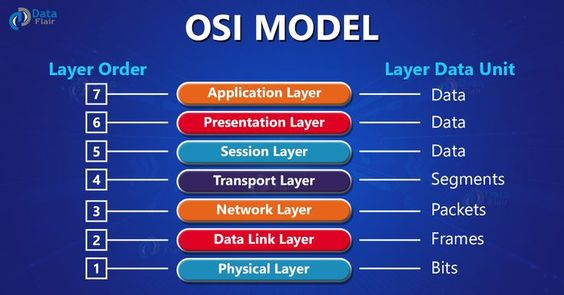

# 1. Mô hình OSI  
## 1.1 Khái niệm  
- Mô hình OSI (Open system interconnection – Mô hình kết nối các hệ thống mở) là một thiết kế dựa vào nguyên lý tầng cấp, lý giải một cách trừu tượng kỹ thuật kết nối truyền thông giữa các máy vi tính và thiết kế giao thức mạng giữa chúng. Mô hình này được phát triển thành một phần trong kế hoạch OSI (Open Systems Interconnection) do ISO và IUT-T khởi xướng. Nó còn được gọi là Mô hình bảy tầng của OSI.

## 1.2 Mục đích ra đời  
- Mô hình OSI được tạo ra với mục đích là cho phép sự tương giao (interoperability) giữa các hệ máy (platform) đa dạng được cung cấp bởi các nhà sản xuất khác nhau. Mô hình cho phép tất cả các thành phần của mạng hoạt động hòa đồng, bất kể thành phần ấy do ai tạo dựng. Vào những năm cuối thập niên 1980, ISO đã tiến cử việc thực thi mô hình OSI như một tiêu chuẩn mạng.

## 1.3 Mô hình mà chức năng của từng lớp
- Mô hình  

- Chức năng của từng lớp

  - 1 **Physical layer - lớp vật lý** 
     - Là tầng thứ nhất trong bảy tầng Mô hình OSI, tầng này chịu trách nhiệm ứng đối với các đòi hỏi về dịch vụ từ Datalink Layer. Chức năng và dịch vụ chính mà tầng vật lý giải quyết là: Thiết lập hoặc ngắt mạch kết nối điện (electrical connection) với một phương tiện truyền thông (transmission medium) Tham gia vào quy trình mà trong đó các tài nguyên truyền thông được chia sẻ hiệu quả giữa nhiều người dùng. Chẳng hạn giải quyết tranh chấp tài nguyên (contention) và điều khiển lưu lượng Điều biến (modulation), hoặc biến đổi giữa biểu diễn dữ liệu số (digital data) của các thiết bị người dùng và các tín hiệu tương ứng được truyền qua kênh truyền thông (communication channel)
  - 2 **Datalink layer - lớp liên kết dữ liệu** 
     - Lớp này đảm bảo việc biến đổi các tin dạng bit nhận được từ lớp dưới (vật lý) sang khung số liệu, thông báo cho hệ phát kết quả thu được sao cho các thông tin truyền lên cho tầng Network không có lỗi. Các thông tin truyền ở tầng Physical có thể làm hỏng các thông tin khung số liệu (frame error). Phần mềm mức hai sẽ thông báo cho mức một tryền lại các thông tin bị mất/lỗi. Đồng bộ các hệ có tốc độ xử lý tính khác nhau, một trong những phương pháp hay sử dụng là dùng bộ đệm trung gian để lưu giữ số liệu nhận được. Độ lớn của bộ đệm này phụ thuộc vào tương quan xử lý của các hệ thu và phát.
  - 3 **Network layer - lớp mạng**
     - Nhiệm vụ của lớp mạng là đảm bảo chuyển chính xác số liệu giữa các thiết bị cuối trong mạng. Để làm được việc đó, phải có chiến lược đánh địa chỉ thống nhất trong toàn mạng. Mỗi thiết bị cuối và thiết bị mạng có một địa chỉ mạng xác định. Số liệu cần trao đổi giữa các thiết bị cuối được tổ chức thành các gói (Packet) có độ dài thay đổi và được gán đầy đủ địa chỉ nguồn (source address) và địa chỉ đích (destination address). Lớp mạng đảm bảo việc tìm đường tối ưu cho các gói dữ liệu bằng các giao thức chọn đường dựa trên các thiết bị chọn đường (Router). Ngoài ra, lớp mạng có chức năng điều khiển lưu lượng số liệu trong mạng để tránh xảy ra tắc nghẽn bằng cách chọn các chiến lược tìm đường khác nhau để quyết định việc chuyển tiếp các gói số liệu.
  - 4 **Transport layer - lớp vận tả**
     - Lớp này thực hiện các chức năng nhận thông tin từ tầng Session chia thành các gói nhỏ hơn và truyền xuống lớp dưới, hoặc nhận thông tin từ lớp dưới chuyển lên phục hồi theo cách chia của hệ phát (Fragmentation and Reassembly). Nhiệm vụ quan trọng nhất của lớp vận chuyển là đảm bảo chuyển số liệu chính xác giữa hai thực thể thuộc tầng Session (end–to–end control). Để làm được việc đó, ngoài chức năng kiểm tra số tuần tự phát, thu, kiểm tra và phát hiện, xử lý lỗi, lớp vận chuyển còn có chức năng điều khiển lưu lượng số liệu để đồng bộ giữa thể thu và phát và tránh tắc ngẽn số liệu khi chuyển qua lớp mạng. Ngoài ra, nhiều thực thể lớp phiên có thể trao đổi số liệu trên cùng một kết nối lớp mạng (multIPlexing).
  - 5 **Session layer - Tầng Session** 
     - Kiểm soát các (phiên) hội thoại giữa các máy tính. Tầng này thiết lập, quản lý và kết thúc các kết nối giữa trình ứng dụng địa phương và trình ứng dụng ở xa. Hỗ trợ hoạt động song công (duplex) hoặc bán song công (half-duplex) hoặc đơn công (Single) và thiết lập các qui trình đánh dấu điểm hoàn thành (checkpointing) – giúp việc phục hồi truyền thông nhanh hơn khi có lỗi xảy ra, vì điểm đã hoàn thành đã được đánh dấu – trì hoãn (adjournment), kết thúc (termination) và khởi động lại (restart). Mô hình OSI uỷ nhiệm cho tầng này trách nhiệm “ngắt mạch nhẹ nhàng” (graceful close) các phiên giao dịch (một tính chất của giao thức kiểm soát giao vận TCP) và trách nhiệm kiểm tra và phục hồi phiên, đây là phần thường không được dùng đến trong bộ giao thức TCP/IP.
  - 6 **Presentation layer - Lớp trình diễn** 
     - Hoạt động như tầng dữ liệu trên mạng. lớp này trên máy tính truyền dữ liệu làm nhiệm vụ dịch dữ liệu được gửi từ tầng Application sang dạng Fomat chung. Và tại máy tính nhận, lớp này lại chuyển từ Fomat chung sang định dạng của tầng Application. Lớp thể hiện thực hiện các chức năng sau: Dịch các mã kí tự từ ASCII sang EBCDIC. Chuyển đổi dữ liệu. Nén dữ liệu để giảm lượng dữ liệu truyền trên mạng. Mã hoá và giải mã dữ liệu để đảm bảo sự bảo mật trên mạng.

  - 7 **Application layer - Tầng ứng dụng** 
     - Là tầng gần với người sử dụng nhất. Nó cung cấp phương tiện cho người dùng truy nhập các thông tin và dữ liệu trên mạng thông qua chương trình ứng dụng. Tầng này là giao diện chính để người dùng tương tác với chương trình ứng dụng, và qua đó với mạng. Một số ví dụ về các ứng dụng trong tầng này bao gồm Telnet, Giao thức truyền tập tin FTP và Giao thức truyền thư điện tử SMTP, HTTP, X.400 Mail remote

## 1.4 Nguyên lý hoạt động 
-  Mô hình OSI sẽ chia làm 2 quá trình ở 2 phía: 
  - Phía gửi tương ứng với quá trình đóng gói (Data Encapsulation)
  - Phía nhận tương ứng với quá trình mở gói (Data De-Encapsulation)

- Quá trình đóng gói 
  - Diễn ra ở phía người gửi dữ liệu của người dùng được gọi là user data sẽ đi từ trên Application xuống từng lớp từng lớp một và không được bỏ qua bất kỳ lớp nào, khi đi tới 1 lớp user data sẽ được bọc vào trong header của lớp đó.  Ở lớp 7 sẽcó layer 7 header, xuống lớp 6 sẽ có layer 6 header, riêng lớp 2 ngoài layer 2 header còn có phần trailer kiểm tra lỗi FCS (Frame Check Sequence), khi đi xuống lớp 1 sẽ chuyển thành bit nhị phân và truyền đi. Phần header chính là phần thông tin quản lý của gói tin còn data chính là phần dữ liệu thực sự của gói tin.
- Quá trình mở gói 
  - Diễn ra ở phía người nhận sẽ ngược lại với qáu trình gửi, dữ liệu sẽ đi ngược từ dưới lên trên, khi đi tới 1 lớp nào sẽ được gỡ bỏ header của lớp đó và cuối cùng trả về user data cho người dùng. Đầu tiên toàn bộ dãy bit nhị phân sẽ được chuyển thành 1 khung dữ liệu, đi lên lớp 2 sẽ được kiểm tra FCS và gỡ bỏ layer 2 header, lên lớp 3 sẽ được gỡ layer 3 header, tương tự đến layer 7 sau khi gỡ bỏ layer 7 header sẽ trả về user data cho người dùng.

- Dữ liệu tại các lớp và tất cả các dữ liệu của các lớp sẽ được gọi chung là các PDU – Protocol Data Unit  

## 2.5 Ưu nhược điểm của mô  hình OSI
- Ưu điểm của mô hình OSI 
  + Mỗi tầng có 1 cấu trúc và chức năng riêng nên dễ dàng xây dựng và sửa chữa
  + Có thể tích hợp trong nhiều mạng lưới khác nhau
  + Hỗ trợ kết nối có liên kết và kết nối phi liên kết
- Nhược điểm của mô hình OSI
  + Tầng phiên và tầng trình diễn thường không được sử dụng nhiều so với các tầng khác vì chức năng hạn hẹp của nó

  + Không hỗ trợ các giao thức, không định nghĩa bất kì giao thức nào

  + Nhiều dịch vụ trùng lặp tại các tầng, ví dụ tầng mạng và tầng liên kết dữ liệu

  + Các tầng không thể hoạt động song song, tầng dưới phải chờ dữ liệu từ tầng trên

# 2. TCP/IP
## 2.1 Khái niệm  
- TCP/IP là tên viết tắt của cụm từ Transmission Control Protocol/Internet Protocol, là một tập hợp các giao thức (protocol) trao đổi thông tin được sử dụng để truyền tải và kết nối các thiết bị trong mạng Internet
## 2.2 Mô hình 
- Một mô hình TCP/IP tiêu chuẩn bao gồm 4 lớp được chồng lên nhau, bắt đầu từ tầng thấp nhất là Tầng liên kết(link= datalink + physical)  → Tầng mạng (Network) → Tầng giao vận (Transport) và cuối cùng là Tầng ứng dụng (Application).

  - Lớp dưới cùng tập trung vào cách truyền các bit qua từng liên kết riêng lẻ. Lớp liên kết dữ liệu tập trung vào việc gửi dữ liệu qua một loại liên kết vật lý. Ví dụ: mạng sử dụng các giao thức liên kết dữ liệu khác nhau cho mạng LAN Ethernet so với mạng LAN không dây. 
  - Lớp network tập trung vào việc cung cấp dữ liệu trên toàn bộ đường dẫn từ máy tính gửi ban đầu đến máy tính đích cuối cùng.
  - Lớp vận chuyển chịu trách nhiệm duy trì liên lạc đầu cuối trên toàn mạng.
  - Tầng ứng dụng sử dụng giao thức cung cấp dịch vụ cho phần mềm ứng dụng đang chạy trên máy tính. Lớp ứng dụng cung cấp một giao diện giữa phần mềm chạy trên máy tính và hạ tầng mạng
- Một số giao thức TCP/IP sử dụng trong cách tầng được liệt kê qua bảng sau:

Các tầng trong mô hình TCP/IP|Giao thức được sử dụng
---|---
Application|HTTP, POP3, STMP
Transport|TCP, UDP
Internet|IP, ICMP
Data Link và Physical|Ethernet, 802.11 (Wi-Fi)

## 2.3 ƯU nhược điểm 
- Ưu điểm của mô hình TCP/IP

  + Thiết lập kết nối giữa các loại máy tính khác nhau

  + Hoạt động độc lập với hệ điều hành

  + Hỗ trợ nhiều giao thức định tuyến

  + Kiến trúc client - server, khả năng mở rộng cao

  + Có thể hoạt động độc lập

  + Hỗ trợ nhiều giao thức định tuyến

  + Nhẹ, không gây nhiều áp lực với máy tính hay mạng

- Nhược điểm của mô hình TCP/IP
 
  + Việc cài đặt khá phức tạp, khó để quản lý 

  + Tầng transport không đảm bảo việc phân phối các gói tin
  
  + Các giao thức trong TCP/IP không dễ để có thể thay thế
  
  + Không tách biệt rõ ràng các khái niệm về dịch vụ, giao diện và giao thức. Do đó nó không hiệu quả để mô tả các công nghệ mới trong mạng mới
  
  + Dễ bị tấn công SYN  - một kiểu tấn công từ chối dịch vụ  
# 3. Mô hình OSI và mô hình TCP/IP

- TCP/IP và OSI là các giao thức mạng truyền thông được sử dụng rộng rãi nhất. Sự khác biệt chính là OSI là một mô hình khái niệm, nó chỉ để tham chiếu mà không được sử dụng thực tế. Thay vào đó, nó xác định cách các ứng dụng có thể giao tiếp qua mạng. Mặt khác, TCP/IP được sử dụng rộng rãi để thiết lập các liên kết và tương tác mạng.

- Điểm giống nhau  
  - Cả hai đều là mô hình logic.
  - Họ xác định các tiêu chuẩn mạng. 
  - Chúng chia quá trình giao tiếp mạng thành các lớp. 
  - Họ cung cấp các khuôn khổ để tạo và triển khai các tiêu chuẩn và thiết bị mạng. 
  - Chúng cho phép một nhà sản xuất tạo ra các thiết bị và thành phần mạng có thể cùng tồn tại và hoạt động với các thiết bị và thành phần do các nhà sản xuất khác sản xuất.
- Điểm khác nhau  

Nội dung|Mô hình OSI|Mô hình TCP/IP
---|---|---
Độ tin cậy và phổ biến|Nhiều người cho rằng đây là mô hình cũ, chỉ để tham khảo, số người sử dụng hạn chế hơn so với TCP/IP|Được chuẩn hóa, nhiều người tin cậy và sử dụng phổ biến trên toàn cầu
Phương pháp tiếp cận|Tiếp cận theo chiều dọc|Tiếp cận theo chiều ngang
Sự kết hợp giữa các tầng|Mỗi tầng khác nhau sẽ thực hiện một nhiệm vụ khác nhau, không có sự kết hợp giữa bất cứ tầng nào|Trong tầng ứng dụng có tầng trình diễn và tầng phiên được kết hợp với nhau
Thiết kế|Phát triển mô hình trước sau đó sẽ phát triển giao thức|Các giao thức được thiết kế trước sau đó phát triển mô hình
Số lớp (Tầng)|7 |4
Truyền thông|Hỗ trợ cả kết nối định tuyến và không dây|Hỗ trợ truyền thông không kết nối từ tầng mạng
Tình phụ thuộc| Giao thức độc lập|Phụ thuộc vào giao thức

# Tham khảo 
- https://wikimaytinh.com/mo-hinh-osi-la-gi.html
- https://wikimaytinh.com/bo-giao-thuc-tcp-ip-la-gi.html
- https://vnpro.vn/thu-vien/mo-hinh-tham-chieu-iso-osi-4043.html 
- https://vnpro.vn/thu-vien/tong-quan-ve-mo-hinh-tcpip-va-mot-so-co-che-cua-giao-thuc-http-4307.html
- https://vnpro.vn/thu-vien/mo-hinh-osi-tcpip-phan-2-3105.html