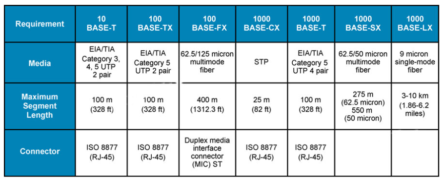
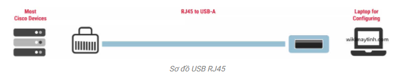
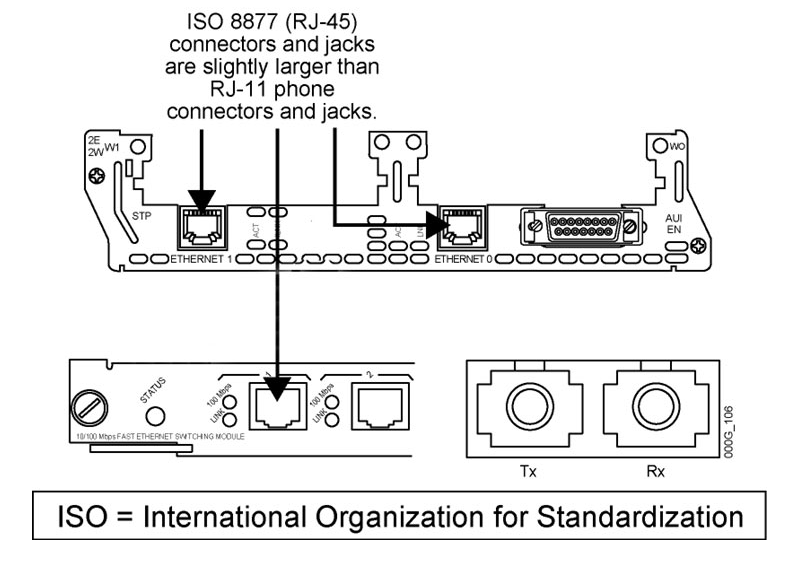
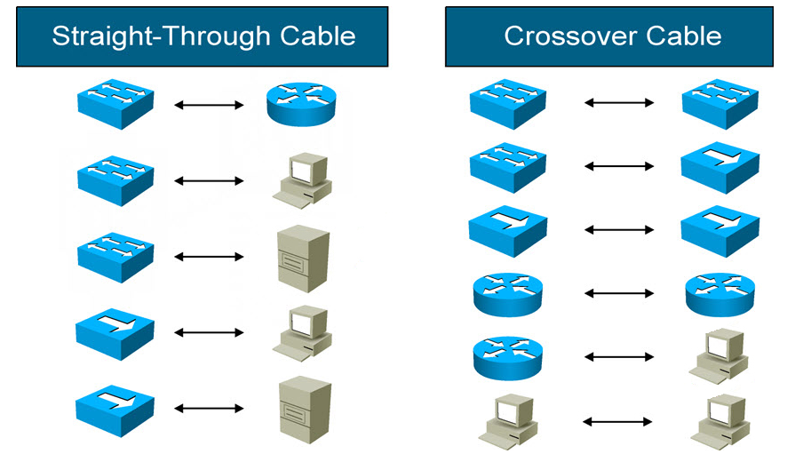
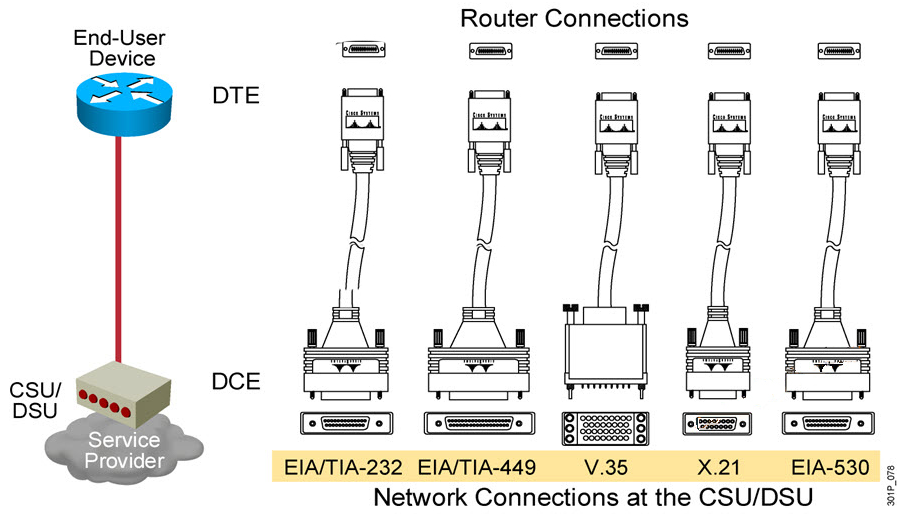

# 1. Các loại cáp trong mạng LAN
- Các loại cáp mạng trong mạng trong hệ thống Ethernet gồm 3 loại cáp : cáp đồng, cáp quang và cáp console.
  - **Cáp đồng**:
    - Cáp xoắn đôi là có vỏ bọc chống nhiễu (STP – Shielded Twisted Pair)
    -  Cáp xoắn đôi  không có vỏ bọc chống nhiễu (UTP – Unshielded Twisted Pair)

    - Các cặp xoắn đôi được chia thành các phân hạng : category (cat), loại cáp được sử dụng phổ biết là   cat5e, cat6, cat6a,...
    - Thông thường trong Lan sử dụng loại cable 1000BASE-CE sử dụng đến 4 cặp dây.

      BASE-T(twisted- pain) là các loại cáp xoắn đôi.
  - **Cáp quang**: gồm 2 loại là cáp quang Singlemode và cáp quang Multimode

  - **Cáp console**: Cáp điều khiển còn được gọi là cáp Console, cáp cuộn, cáp lập trình hoặc cáp quản lý – được thiết kế cho một mục đích cụ thể. Chúng kết nối các thiết bị mạng của Cisco với thiết bị đầu cuối hoặc máy tính để cấu hình.

    - Các loại cáp console 
      - RJ45 đến DB9

      - USB A đến Mini-B

      - USB sang RJ45

# 2. Đầu nối cho các loại cable trong mạng LAN
- Đầu nối của các loại cable bao gồm :
  - RJ45 : dùng cho loại cable kết nối trong hệ thống Lan
  - RJ11 : dùng cho loại cable kết nối trong hệ thống Voice
- Trên 1 cọng dây cáp quang thường có 2 đường dây quang.
  - Tx: đường dây phát tín hiệu
  - Rx: Đường dây thu tín hiệu

# 3. Kỹ thuật bấm cáp
- Có 2 kỹ thuật bấm cáp chính theo chuân quốc tế là
  - T568A (kỹ thuật bấm cáp thẳng) 
  - T568B (Kỹ thuật bấm cáp chéo)

- Tùy vào việc đấu nối giữa loại thiết bị nào với thiết bị nào mà chúng ta sẽ chọn chuẩn bấm cáp. Ví dụ như đấu nối dây giữa switch với switch thì chúng ta sẽ sử dụng dây cáp chéo.

T568A (Straight-Through) : Kỹ thuật bấm cáp thẳng sử dụng để đấu nối 2 loại thiết bị khác nhóm với nhau.

T568B (Crossover Cable) : Kỹ thuật bấm cáp chéo sử dụng để đấu nối 2 loại thiết bị cùng nhóm với nhau.

- Ứng dụng  kỹ thuật bấm cáp 
  - Để dùng chuân nào thì thiết bị được chia làm 2 nhóm :
    - Router,computer,server …
    - Switch,hub …
  - Khi bấm thì các thiết bị cùng nhóm thì sử dụng cáp chéo
  - Các thiết bị khác nhóm sử dụng cáp thẳng

- Ví dụ 

# 4. Các loại cáp sử dụng trong WAN
- Trong WAN sử dụng các loại cáp Serial để đấu nối
  - Tại router sử dụng các cổng WIC-1T và được đấu nối vào đầu DB 6 chân của cáp
  - Phía nhà cung cấp dịch vụ thường là các chuẩn : EIA/TIA-232, V35, X21 … Loại đấu nối thông dụng nhất trong lease line là V35

# Tham khảo
- https://vtxvn.com/cac-loai-cap-mang-trong-mang-lan/
- https://wikimaytinh.com/cap-dieu-khien-console-la-gi.html