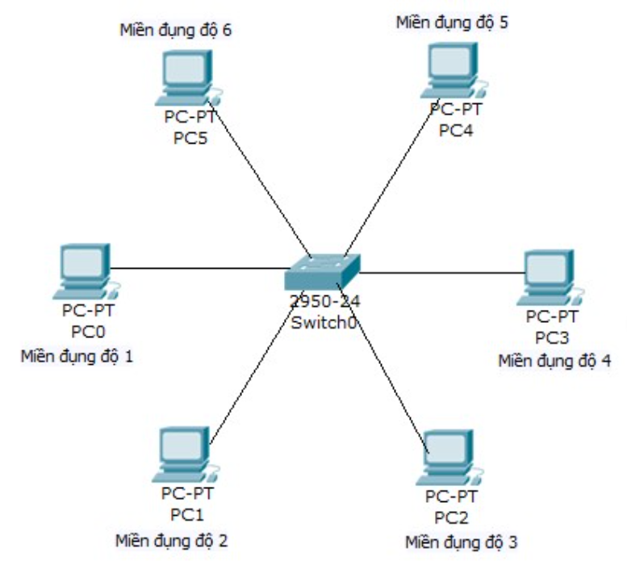

# 1. Khái niệm 
## 1.1 Chuyển mạch  
- Chuyển mạch là một quá trình thực hiện đấu nối và chuyển thông tin người sử dụng  thông qua hạ tầng mạng viễng thông. 
- Switch trong mạng viễn thông bao gồm chức năng chuyển định tuyến cho thông tin và chức năng chuyển tiếp thông tin.
- Hoạt động ở lớp datalink trong mô hình OSI
## 1.2 Phân đoạn mạng bằng switch
- Switch sẽ phận đoạn mạng thành các đoạn nhỏ, thu nhỏ miền tối đa kích thước miền đụng độ 
- Các host kết nối với cùng 1 switch có cùng miền broadcast 

- Trong mạng Ethernet LAN thuần chuyển  mạch, các node thực hiện chức năng chuyển mạch giống như trong mạng chỉ có duy nhất mình nó.
- Khi 2 node được thiết lâp kết nối, một mạch ảo được thiết lập giữa chúng và cung cấp toàn bộ băng thông mạng. Mạch ảo này chỉ tồn tại trong switch kho các node cần trao đổi
- Các kết nối bằng switch cung cấp nhiều thông lượng hơn so với Ethernet LAN kết nối bnăgf Bridge hay Hub
## 1.3 Hoạt động chuyển mạch cơ bản của Switch
- Chuyển mạch là một kỹ thuật giúp giảm tắc nghẽn trong mạng Ethernet, Token Ring và FDDI.
-  Switch thực hiện các hoạt động chính như sau:
  - Chuyển mạch frame
  - Bảo trì hoạt động chuyển mạch  
  - Khả năng truy cập trên từng cổng 
  - Loại trừ đụng độ và tăng thông lượng đường truyền 
  - Hỗ trợ nhiều phiên giao dịch cùng lúc 
  - Chuyển mạch frame dựa trên bảng chuyển mạch  
  - Chuyển Frame dựa theo địa chỉ MAC
  - Hoạt động ở lớp 2 mô hình OSI
  - Học vị trí kết nối của từng máy trạm bằng cách ghi nhận  địa chỉ nguồn trên frame nhận vào 
  - Chuyển frame ra tất cả các cổng khi địa chỉ đích là địa chỉ quảng bá, munticast hoặc một địa chỉ mà switch không biết 
  - Chỉ chuyển frame ra cổng khác khi địa chỉ đích nằm trong cổng khác với cổng nhận vào  
## 1.4 Một số đặc điểm của Switch
### Switch học địa chỉ 
- Switch chỉ chuyển từ segmant này sang segment  khác khi cần thiết. Switch phải biết thiết bị nào kết nối vào segment nào
- Switch học địa chỉ theo cách sau:
  - Đọc địa chỉ MAC nguồn mỗi trong mỗi frame nhận được  
  - Ghi nhận số cổng mà nó vừa nhận frame
  - Địa chỉ học được và số cổng tưởng ứng sẽ được lưu trong CAM. Mỗi địa chỉ được đánh dấu khoảng thời gian lưu trữ nhất định  
  - CAM sẽ lưu trữ bảng địa chỉ MAC và số cổng tương ứng . CAM so sánh địa chỉ MAC nhận được với nội dung của bảng CAM. Nếu tìm thấy đúng địa chỉ thì số cổng tương ứng sẽ cđược chọn để chuyển gói ra 
  - CAM được sử dụng cho các hoạt động sau  
    - Lấy ra thôgn tin đạic hỉ trong gói dữ liệu nhận được và xử lý chúng 
    - So sánh địa chỉ đích của frame với các địa chỉ trong bảng của nó 
  - Sau đó, mỗi Switch đọc một địa chỉ nguồn của frame, địa chỉ đánh dấu trong CAM sẽ được đánh dấu thời gian mới. Nếu trong suất khoảng thời gian đánh dấu mà switch không ghi nhận gì nữa về địa chỉ đó thì nó sẽ xóa địa chỉ đó ra khỏi bảng. Nhờ vậy mà CAM luôn giữ được thông tin của mình chính xác và kịp thời  
### Thông tin liên lạc giữa Switch và máy trạm
- Khi một máy trạm được kết nối vào LAN, nó không cần quan tâm đến thiết bị khác cùng kết nối vào LAN đó.
- Máy trạm chỉ đơn giản là sử dụng NIC (Network Interface Card) để truyền dữ liệu xuống môi trường truyền.
- Máy trạm có thể kết nối trực tiếp với một máy trạm khác bằng cáp chéo hoặc là kết nối vào một thiết bị mạng như là Hub, Switch hoặc Router bằng cáp thẳng. Switch là thiết bị Lớp 2 thông minh, có thể học địa chỉ MAC của các thiết bị kết nối vào cổng của nó.
- Cho đến khi thiết bị bắt đầu truyền dữ liệu đến Switch thì nó mới học được địa chỉ MAC của thiết bị trong bảng chuyển mạch. Còn trước đó nếu thiết bị chưa hề gửi dữ liệu gì đến Switch thì Switch chưa nhận biết gì về thiết bị này.
###  Switch và miền đụng độ
- Đụng độ xảy ra khi hai máy tính truyền dữ liệu đồng thời. Khi đụng độ xảy ra mọi frame đang được truyền bị phá hủy.
- Các máy đang truyền sẽ ngưng việc truyền dữ liệu lại và chờ một khoảng thời gian ngẫu nhiên theo quy luật CMSA/CD. Nếu đụng độ nhiều quá mức sẽ làm không hoạt động được.
- Miền đụng độ là khu vực mà frame được phát hiện ra có thể bị đụng độ. Khi một máy kết nối vào một cổng của Switch, Switch sẽ tạo một kết nối riêng biệt với băng thông 10 Mbps cho máy đó. Kết nối này là một miền đụng độ riêng. Ví dụ: nếu ta kết nối 6 máy vào 6 cổng của một Switch thì ta sẽ tạo 6 miền đụng độ riêng biệt.

### Switch và miền quảng bá
- Thông tin liên lạc trong mạng được thực hiện theo 3 cách sau:
  -  Unicast: gửi trực tiếp từ một máy phát tới một máy thu. Đây là hình thức truyền chủ yếu trong mạng LAN và Internet.

  - Multicast: là cách truyền tin được gửi từ một máy đến một mạng con hay một nhóm nằm trong segment.

  - Broadcast: là cách truyền tin được gửi từ một máy đến tất cả các máy khác trong mạng.

- Khi một thiết bị gửi một gói tin quảng bá đến lớp 2 thì địa chỉ MAC của frame đó là  `FF:FF:FF:FF:FF:FF`. Mọi thiết bị trong mạng sẽ đều phải nhận và xử lý gói tin quảng bá. 
- Khi Switch nhận được gói tin quảng bá thì switch sẽ chuyển gói tin quảng bá qua tất cả các cổng trừ cổng vừa nhận gói tin .
- Ví dụ  
  - Khi một thiết 

# Tham Khảo

- https://vnpro.vn/tin-tuc/khai-niem-chuyen-mach-va-chuyen-mach-co-ban-cua-switch-1025.html
- https://vnpro.vn/thu-vien/mot-so-dac-diem-cua-swicth-hoc-dia-chi-thong-tin-lien-lac-mien-dung-do-2103.html
- https://vnpro.vn/thu-vien/switch-va-mien-quang-ba-2106.html