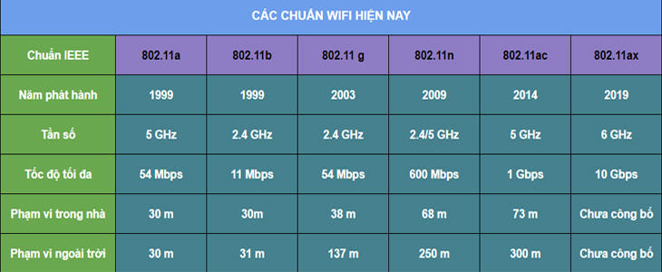
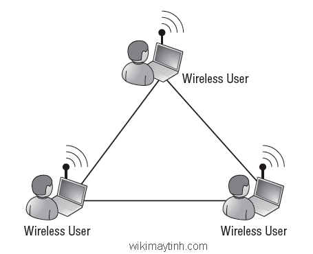
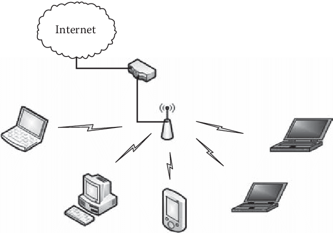

# 1. Giới thiêu  
- Mạng LAN không giây là một loại mạng cục bộ sử dụng sóng điện từ để truyền tín hiệu trong môi trường vô tuyến  
- Các chuẩn trong wireless lan  
  * Năm 1997 IEEE đã giới thiệu một chuẩn đầu tiên cho wireless lan là 11 

  * IEEE 802.11 dựa vào kiến trúc tế bào, là kiến trúc trong đó ệ thống được chia nhỏ ra thành mỗi cell (được gọi là tập hợp các dịch vu cơ bản, hoặc BSS- Basic Service Set) được kiểm soát bởi một trạm cơ sở gọi là điểm tru cập  AP (Acsses Point).
  * Các AP được nối tới mạng sương sống được gọi là hệ phân phối DS (Distribution System)
  * Tập hợp nhiều các cell gọi là ESS- Extended Set (ập hợp dịch vụ được mở rộng)
# 2. Các loại cấu hình của Wlan
## 2.1 Mạng tùy biến  (ad-hoc)
- Là một loại mạng Wlan mà ở đó các trạm đầu cuối có thể giao tiếp trực tiếp với các trạm đầu cuối khác mà không cần sử dụng các thiết bị truy cập AP hay một mạng hữu tuyến  

- Trong mạng này các mạng đầu cuối hình thành nên một kết nối ngang hàng với nhau, có thể trao đổi thông tin trực tiếp với nhau, không cần phải quản trị mạng 
- Đặc điểm 
  - Thiết lập nhanh  
  - Dễ dàng 
  - Không cần công cụ hay kỹ thuật đặc biệt nào  
- Ứng dụng 
  - Thích hợp sử dụng trong các hội nghị thương mai hay các cuộc họp tạm thời  
- Nhược điểm 
  - Vùng phủ sóng bị giới hạn  
  - Mọi người sử dụng phải đồng thời nghe được lẫn nhau  
## 2.2 Mạng cơ sở (BSS- Basic Service Set)
- Là mạng lan không dây trong đó bao gồm một điểm truy cập AP kết nối tới một mạng đường trục hữu tuyến vầ giao tiêó với các thiết bị di động trong một vùng phủ sóng của một tế bảo (cell).
- AP đóng vai trò điều khiển tế bào và điều kiểu lưu lượng tới mạng. Các thiết bị không giao tiếp trực tiếp với nhau mà thông qua các AP
- Một AP cùng với các trạm truy cập gọi là một tập dịch vụ cơ sở (BSS) 

## 2.3 Mạng mở rộng (ESS-Extended Service Set)
- Là mạng lan không dây trong đó bao gồm nhiều AP được kết nối tới cùng một mạng đường trục hữu tuyến
- ESS là một tập hợp các BSS với các AP có thể giao tiếp với nhau để chuyển lưu lượng  từ BSS này sang BSS khác phụ vụ cho việc di động giữa các BSS

## Ưu và nhược điểm  
### Ưu điểm 
- Có thể thêm bớt hoặc di chuyển các máy trạm  hết sức dễ dàng
- Có thể truy cập vào từ bất cứ nơi nào trong phạm vi hoạt động của các điểm truy cập  
- Cài đặt nhanh chóng dễ dàng  
- Phù hợp với các  tòa nhà di động hoặc bán kiên cố như văn phòng đặt tại các công trình xây dựng
- Chi phí lắp đặt thấp
## Nhược điểm  
- Vấn đề bảo mật, có khả năng bị tấn công cao 
- Phạm vi địa lý của wlan nhỏ, chỉ vài chục mét, khoảng cách giữa máy khách và AP còn phụ thuộc vào các chuẩn 
- Sóng điện từ dễ bị ảnh hưởng bởi các loại nhiễu 
- Tốc độ truyền thông tin từ vài Mbits đến vài trăm Mbits , chậm hơn so với mạng sử dụng cáp.
- Hầu hết các mạng Wlan cần một mạng lan kép làm xương sống cho nó. vì vậy wlan không phải một giải pháp hoàn chỉnh 

- https://atpsoftware.vn/wireless-la-gi.html
- https://medium.com/networks-security/wireless-lan-wap-bss-bssid-ssid-ess-essid-5de3a81957f0