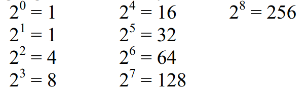
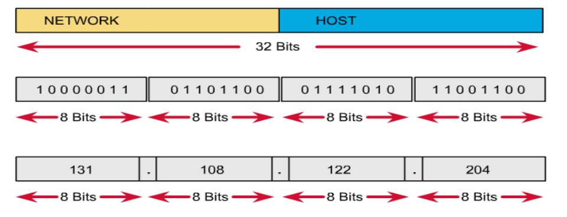
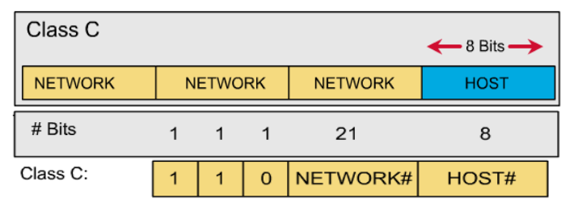
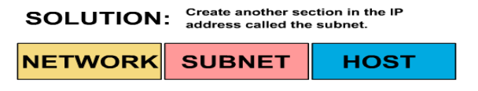

# 1. Một số điểm cần nhớ 
- Bảng lũy thừa cần nhớ 


- Chuỗi nhị phân 8bit cùng các số thập phâm tương ứng phục vụ cho việc tính nhanh subnet mask:

Chuỗi nhị phân 8 bit | Giá trị thập phân 
---|---
00000000|0
10000000|128
11000000|192
11100000|224
11110000|240
11111000|248
11111100|252
11111110|254
11111111|255

- Bảng bước nhảy: bảng này được sử dụng để tính toán trong phép chia subnet

Số bit mượn  | 1|2|3|4|5|6|7|8|
---|---|---|---|---|---|---|---|---
bước nhẩy|128|64|32|16|8|4|2|1


# 2. Địa chỉ IP  
- Địa chỉ IP là địa chỉ logic được sử dụng trong giao thức IP của lớp internet thuộc mô hình TCP/IP(ứng với lớp thứ 3 - lớp network của mô hình OSI)
## 2.1 Cấu trúc địa chỉ IP  
- Địa chỉ IP gồm 32 bit nhị phân chia thành 4 cụm 8 bit (được gọi là các octet). 
- Các octet được được biểu diễn dưới dạng thập phân và ngăn cách nhau bởi dấu chấm 
- Địa chỉ ip gồm 2 phần là phần mạng mà phần host 


- Nguyên tắc đặt địa chỉ ip
  - Các bit phần mạng khong được phép đồng thời bằng 0
  - Nếu các bit phần host bằng 0 ta có một địa chỉ mạng. ví dụ 192.168.1.0
  - Nếu các bit host bằng 1 ta có một địa chỉ quảng bá. ví dụ  192.168.1.255
  - Địa chỉ mạng và địa chỉ quảng bá không được phép gán cho  host

## 2.2 Các lớp địa chỉ  
### Địa chỉ lớp A
- Địa chỉ lớp A có sử dụng 1 octet đầu làm phần mạng và 3 octet sau làm phần host. 
- Bit đầu của phần mạng bằng 0. Sử dụng để nhận dạng lớp A
- Địa chỉ lớp A chay từ 1.0.0.0 ->  127.0.0.0
- Mạng 127.0.0.0 được sử dụng làm loopback nên địa chỉ mạng sử dụng được chạy  từ 1.0.0.0 -> 126.0.0.0
- Phần host có 24 bit mạng -> mỗi mạng trong lớp A có thể đánh địa chỉ cho (2^24-2) host 

> Địa chỉ 127.0.0.1 được sử dụng làm loopback trên các host để kiểm tra chồng giao thức TCP/IP có được cài đặt hay không
### Địa chỉ lớp B
- Địa chỉ lớp B sử dụng 2 octet đầu làm phần mạng và 2 octet ssau làm phần host
- 2 bit đầu của lớp B luôn là 1 và 0. 14 bit sau được sử dụng để định danh cho phần mạng.
- Đại chỉ mạng lớp B  gồm 128.0.0.0 -> 191.255.0.0
- Phần host có 16 bit -> mỗi mạng lớp B có thể dánh cho (2^16-2) host


### Địa chỉ lớp C
- Địa chỉ lớp C sử dụng 3 octet đầu làm phần mạng và 1 octet cuối làm phần host 
- 3 bít đầu của phần mạng luân là 1 1 0. 21 bit tiếp theo đuọc sự dụng để định danh cho phần mạng
- Địa chỉ lớp C gồm  192.0.0.0 -> 223.255.255.0
- Phần host có 8 bit _> mỗi mạng lớp C có thể đánh cho (2^8-2) host


### Địa chỉ lớp D
- Địa chỉ lớp D chạy từ  224.0.0.0.0 -> 239.255.255.255
- Dùng làm địa chỉ multicast
- Ví dụ 
  - 224.0.0.5 dùng cho OSPF
  - 224.0.0.9 dùng cho RIPv2
### Địa chỉ lớp E
- Chạy từ 240.0.0.0 trở đi  
- Được dùng cho mục đích dự phòng 

### Địa chỉ broadcast
- Direct được sử dụng để gửi broadcast trên một mạng khác
  - ví dụ 192.168.2.1 gửi broadcast đến  192.168.1.255 thì tất cả host trong mạng  192.168.1.0 sẽ nhận được broadcast
- Local được sử dụng đẻ gửi broadcast trên cùng một mạng 
  - ví dụ 192.168.2.1 gửi broadcast đến 255.255.255.255 thì tất cả host trong mạng  192.168.2.0 sẽ nhận được broadcast
>Nhận dạng địa chỉ các lớp:1  126: địa chỉ lớp A.
  
128 -> 191: địa chỉ lớp B.

192 -> 223: địa chỉ lớp C.

224 -> 239: địa chỉ lớp D.

240 -> 255: địa chỉ lớp E.

## 2.3 Địa chỉ private và public
- Địa chỉ private: đuọc sử dụng trong mạng nội bộ (LAN), không kết nối được ra ngoài môi trường internet. Chúng có thể sử dụng lại trong các mạng LAN. Địa chỉ private giúp bảo tồn địa chỉ IP public đang dần cạn kiệt 
- Địa chỉ public: là địa chỉ sử dụng cho các gói tin truyền trên internet, được kết nối được ra ngoài môi trường internet, không sử dụng trong lan. Địa chỉ public phải là duy nhất cho mỗi host tham gia môi trường internet
- Dải địa chi private(quy định trong RFC 1918)
  - Lớp A: 10.x.x.x
  - Lớp B: 172.16.x.x - 172.31.x.x
  - Lớp C: 192.168.x.x
- NAT(Network access translation) được sử dụng để chuyển đỗi giữa địa chỉ private và public 

# 3. Chia Subnet
## 3.1 Chia subnet mask và số prefix
### Subnet mask 
- Subnet mask là một dải dài 32 bit đi kèm với đại chỉ IP , được sử dụng để host xác định được địa chỉ mạng của địa chỉ ip mà host đạng sử dụng.
- Toán tử AND được host sử dụng để xác định địa chỉ mạng thông qua địa chỉ ip và địa chỉ subnet
```
Phép toán AND:
0 AND 0 = 0
0 AND 1 = 0
1 AND 0 = 0
1 AND 1 = 1 
```
- Ví dụ  
  - Xét địa chỉ 192.168.1.1 với subnet tương ứng là 255.255.255.0

| |dạng thập phân |dạng nhị phân
--- |---|---
Địa chỉ IP | 192.168.1.1|11000000.10101000.00000001.00000001
Địa chỉ subnet | 255.255.255.0|11111111.11111111.11111111.00000000
Địa chỉ mạng| 192.168.1.0 |11000000.10101000.00000001.00000000

- Subnet chuẩn 
  - Lớp A: 255.0.0.0
  - Lớp B: 255.255.0.0
  - Lớp C: 255.255.255.0

### Số prefix
- Khi khai báo địa chỉ ip ta luân phải khai báo thêm địa chỉ subnet. Số prefix được sử dụng để mô tả subnet một cách ngắn gọn.
- Số prefix là số bit mạng trong một địa chỉ ip, được ngăn cách với địa chỉ IP bằng dấu "/"
- số prefix chuẩn của các lớp A, B, C lần lượt là /8,/16,/24
- Ví dụ  192.168.1.1/24, 172.16.0.0/16, 10.10.10.1/8, ....
- **Nguyên lý cơ bản của kỹ thật chia subnet**: Để chia một mạng lớn thành nhiều mạng con bằng nhau, người ta thực hiện mượn bit từ phần host để làm phần mạng, bit bị mượn gọi là bit subnet. Tùy theo số lượng bit subnet mà ta có được số lượng mạng con khác nhau  vói các kích cỡ khác nhau  



# 4. Bài tập chia subnet
## 4.1 Cho một mạng lớn và số bít mượn 
- Xác định  
  - Số subnet
  - Số host/subnet
  - Địa chỉ mạng mỗi subnet
  - Địa chỉ host đầu mỗi subnet
  - Địa chỉ host cuối mỗi subnet
  - Địa chỉ broadcast mỗi subnet
  - Subnet mask được sử dụng  
- Cách tính  
  - Gọi n là số bit mượn và m là số bit host còn lại 
    - Số subnet chia được
      - 2^n -2 nêu không hỗ trợ subnet-zero
      - 2^n nếu có hỗ trợ subnet-zero 
    - Số host có thể chia được: 2^m-2 host

  - Với mỗi subnet
    - Địa chỉ mạng: octet bị mượn là bội số của bước nhảy
    - Địa chỉ host đầu: địa chỉ mạng + 1 
    - Địa chỉ host cuối: địa chỉ mạng + bước nhẩy -2
    - Địa chỉ broadcast: địa chỉ mạng + bước nhẩu -1
###  Ví dụ 
- **192.168.2.0/24 mượn 5 bit.**
  - Ta có n =5, m =3

  - Số subnet chia được 2^5 =32
  - Số host chia được 2^3-2 = 6
  - Địa chỉ mạng có octet thứ 4 là bội số của 8

  
  Địa chỉ mạng | Địa chỉ host đầu   | Địa chỉ host cuối | Địa chỉ broadcast
  ---|---|---|---
  192.168.2.0/29 |192.168.2.1/29 |192.168.2.6/29 |192.168.2.7/29
  192.168.2.8/29 |192.168.2.9/29 |192.168.2.14/29|192.168.2.15/29
  192.168.2.16/29|192.168.2.17/29|192.168.2.22/29|192.168.2.23/29
  192.168.2.24/29|192.168.2.25/29|192.168.2.30/29|192.168.2.31/29
  192.168.2.32/29|192.168.2.33/29|192.168.2.38/29|192.168.2.39/29
  ...|...|...|...
  192.168.2.240/29|192.168.2.241/29|192.168.2.246/29|192.168.2.247/29
  192.168.2.248/29|192.168.2.249/29|192.168.2.254/29|192.168.2.255/29

  - Địa chỉ subnet mask  tương ứng 

  11111111.11111111.11111111.11111000=255.255.255.248/29

- **172.16.0.0/16 mượn 3 bit**
  - Ta có n=3, m =13
  - Số subnet chia được là 2^3=8
  - Số host mỗi mạng là 2^13-2
  - Địa chỉ mạng có octet thứ 3 là bội số của 32


  Địa chỉ mạng | Địa chỉ host đầu   | Địa chỉ host cuối | Địa chỉ broadcast
  ---|---|---|---
  172.16.0.0/19 |172.16.0.1/19|172.16.31.254/19|172.16.31.255/19
  172.16.32.0/19|172.16.32.1/19|172.16.63.254/19|172.16.63.255/19
  172.16.64.0/19|172.16.64.1/19|172.16.95.254/24|192.16.93.255/19
  ...|...|...|...
  172.16.224.0/19|192.16.224.1/19|192.16.255.254/24|192.16.255.255/24

  - Địa chỉ subnet mask  tương ứng 
  
  11111111.11111111.11100000.00000000 = 255.255.224.0/19
- **172.16.0.0/16 mượn 12 bit**

  - Ta có n = 12, m = 4
  - Số subnet chia được là 2^12
  - Số host mỗi mạng là 2^4-2 = 14
  - Địa chỉ mạng có octet thứ 4 là bội số của 16

  Địa chỉ mạng | Địa chỉ host đầu   | Địa chỉ host cuối | Địa chỉ broadcast
  ---|---|---|---
  172.16.0.0/28|172.16.0.1/28|172.16.0.14/28|172.16.0.15/28
  172.16.0.16/28|172.16.0.17/28|172.16.0.30/28|172.16.0.31/28
  172.16.0.32/28|172.16.0.29/28|172.16.0.46/28|172.16.0.47/28
  ...|...|...|...
  172.16.1.0/28|172.16.1.1/28|172.16.1.14/28|172.16.1.15/28
  172.16.1.16|172.16.1.17/28|172.16.1.30/28|172.16.1.31/28
  ...|...|...|...
  172.16.255.240/28|172.16.255.241/28|192.168.255.254/28|192.168.255.255/28

  - Địa chỉ subnet mask  tương ứng 
    
    11111111.11111111.11111111.11110000 = 255.255.255.240/28


## 4.2 Cho sơ đồ mạng, xác định số bit mượn phù hợp để chia subnet
**Cho mạng 172.16.5.0/24. Hãy chia nhỏ sao cho phù hợp với sơ đồ sau**


- Có tất cả 7 mạng, mạng nhiều nhất có 79 host (tính cả địa chỉ cổng router)
Gọi số bit mượn là n số bit host là m. Ta có hệ sau:
  - 2^n ≥ 7 (số mạng chia ra tối thiểu phải bằng 7)-> n= 3,4,5,...
  - 2^m -2 ≥ 79 (nếu mỗi mạng con đáp ứng được số host của mạng 26 host, nó sẽ đáp ứng được yêu cầu về số host của tất cả các mạng còn lại trên sơ đồ). -> m = 7,8,9...
  - m+n=8

- Không có cặp m.n nào thỏa mãn. ta cần chia mạng theo kiểu VLSM (Variable Length Subnet Mask)

- Ta có mạng thứ nhất 78 host
  - có 2^m -2 ≥ 79 -> m=7,8,9 
  - Lấy số bit host m=7 ->n = 1
  - Số subnet chia được là 2^1 = 2 
  - Số host mỗi mạng là  2^7-2= 126
  - Địa chỉ mạng có octet thứ 4 là bội số của 128
  - 2 subnet được chia là 172.16.5.0/25 và 172.16.5.128/25
  - Sử dụng mạng 172.16.5.0/25 cho mạng thứ nhất  
- Ta có mạng thứ 2 có 50 host
  - Có  2^m-2> 51 -> m= 6,7,8
  - Lấy m=6 -> n=2
  - Số subnet chia được là 2^2 =4
  - Số host mỗi mạng là 2^6-2 = 62
  - Địa chỉ mạng có octet thứ 4 là bội số của 64
  - 4 subnet được chia là 172.16.5.128/26, 172.16.5.192/26, 172.168.6.0/26, 172.168.6.64/26
  - Sử dụng mạng 172.16.5.128/26 cho mạng thứ 2
- Ta có mạng thứ 3 có 20 host 
  - Có  2^m-2> 21 -> m= 5,6,7,8
  - Lấy số bit host m=5 ->n = 3
  - Số subnet chia được là 2^3 = 8
  - Số host mỗi mạng là  2^5-2= 30
  - Địa chỉ mạng có octet thứ 4 là bội số của 32
  - 8 Subnet được chia là 172.16.5.192/27, 172.16.5.224/27,....
  - Sử dụng mạng 172.16.5.192/27 cho mạng thứ 3
- Ta có mạng thứ 4 có 10 host 
  - Có  2^m-2> 21 -> m= 4,5,6,7,8
  - Lấy số bit host m=4 ->n = 4
  - Số subnet chia được là 2^4 = 16
  - Số host mỗi mạng là  2^4-2= 14
  - Địa chỉ mạng có octet thứ 4 là bội số của 16
  - 16 Subnet được chia là 172.16.5.224/28, 172.16.5.240/28,...
  - Sử dụng mạng 172.16.5.224/28 cho mạng thứ 4
- Ta có mạng thứ 5 có 5 host 
  - Có  2^m-2> 21 -> m= 3, 4,5,6,7,8
  - Lấy số bit host m=3 ->n = 5
  - Số subnet chia được là 2^5 = 32
  - Số host mỗi mạng là  2^3-2= 6
  - Địa chỉ mạng có octet thứ 4 là bội số của 8
  - 32 Subnet được chia là 172.16.5.240/29, 172.16.5.248/29,...
  - Sử dụng mạng 172.16.5.240/29 cho mạng thứ 5 
- Tiếp đó ta xét đến các mạng có 2 host là các liên kết điểm – điểm serial, ta xem thử mượn bao nhiêu bit là phù hợp:
  - Có  2^m-2> 2 -> m= 2, 3, 4, 5, 6, 7, 8
  - Lấy số bit host m=2 ->n = 6
  - Số subnet chia được là 2^6 = 64
  - Số host mỗi mạng là  2^2-2= 2
  - Địa chỉ mạng có octet thứ 4 là bội số của 4
  - 32 Subnet được chia là 172.16.5.248/30, 172.16.5.252/30,...
  - Ta lấy 2 mạng 172.16.5.248/30 và  172.16.5.252/30 gán cho hai liên kết serial.

- Kết quả chia VLSM là 


## 4.3 Cho một địa chỉ host. Xác định xem host thuộc mạng nào

- **192.168.1.130/29**
  - Địa chỉ có số prifix =29 -> bit bị mượn ở bit octet thứ 4 và số bit mượn là n = 5 -> bước nhẩy là 8
  - Lấy octet thứ 4 chia 8 = 130/8 = 16 và còn dư
  - Lấy 16*8 = 128 
  -> Host này thuộc mạng 192.168.1.128/29
- **172.16.34.57/18**
  - Địa chỉ có số prifix =18 -> bit bị mượn ở bit octet thứ 3 và số bit mượn là n = 2 -> bước nhẩy là 64
  - Lấy octet thứ 3 chia 64 = 34/64 = 0 và còn dư
  - Lấy 0*64=0 
  -> Host này thuộc mạng 172.166.0.0/18
- **203.162.4.191/28**
  - Địa chỉ có số prifix =28 -> bit bị mượn ở bit octet thứ 4 và số bit mượn là n = 4 -> bước nhẩy là 16
  - Lấy octet thứ 4 chia 16 = 191/16 = 11 và còn dư
  - Lấy 11*16=176
  -> Host này thuộc mạng 203.162.4.176/28

## 4.4 Tóm tắt địa chỉ (summary)

a)

192.168.0.0/24

192.168.1.0/24

192.168.2.0/24

192.168.3.0/24

- Ta xét chi tiết octet 

192.168.000000|00.00000000

192.168.000000|01.00000000

192.168.000000|10.00000000

192.168.000000|11.00000000

- Ta thấy octet thứ 3 có 6bit giống nhau. Vậy ta có mạng tóm tắt là 192.168.0.0/22

b)

172.16.16.0/24

172.16.20.0.24

172.16.24.0/24      

172.16.28.0/24

- Ta xét chi tiết octet 

172.16.0001|0000.0

172.16.0001|0100.0

172.16.0001|1000.0

172.16.0001|1100.0

- Ta thấy octet thứ 3 có 4 bit giống nhau. Vậy ta có mạng tóm tắt là 172.16.0.0/20


# Tham khảo 

- https://vnpro.vn/thu-vien/chuong-1-dia-chi-ipv4-chia-subnet-vlsm-summary-4108.html
- https://wikimaytinh.com/subnet-mask-la-gi-cach-chia-subnet-subnetting.html