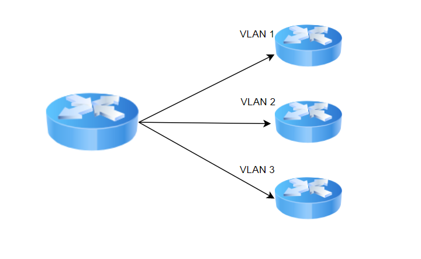
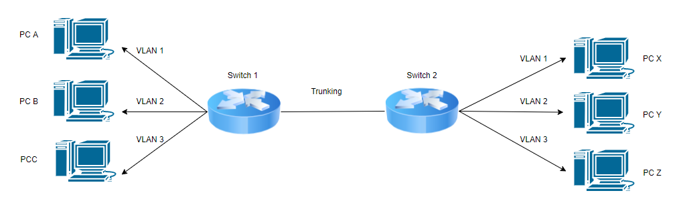
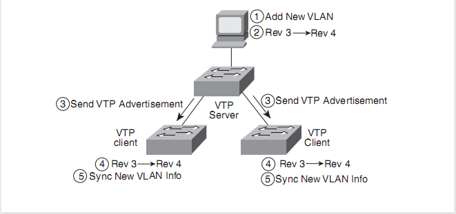
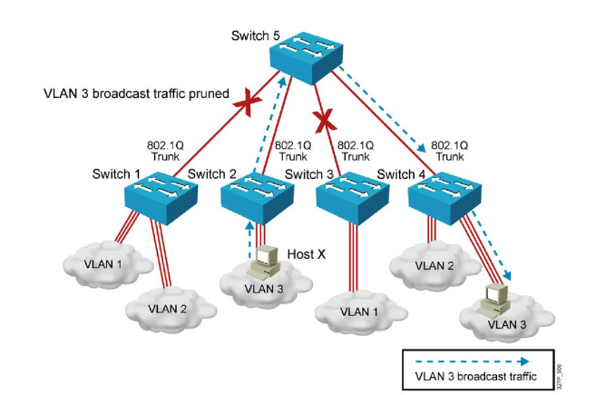

# 1. VLAN là gì?
- VLAN là viết tắt của Virtual Local Area Network hoặc Virtual LAN, có nghĩa là Mạng cục bộ ảo” hoặc “Mạng LAN ảo”
- VLAN là một mạng tùy chỉnh được tạo từ một hoặc nhiều mạng LAN hiện có. Nó cho phép các nhóm thiết bị từ nhiều mạng (cả có dây và không dây ) được kết hợp thành một mạng logic duy nhất. Kết quả là một mạng LAN ảo có thể được quản lý giống như một mạng cục bộ vật lý.
- Có 2 cách nhìn về VLAN
  - 1 Switch - 1 logical switch: mỗi VLAN là một switch thu nhỏ 
    
    - Các VLAN sử dụng cùng một bảng MAC nhưng được chia thành các khu vực riêng biệt cho từng VLAN 
  - 1 Switch-network: mỗi vlan được gọi là một broadcast domain 
    

    - Trên cùng một VLAN khi gán ip cần phải sử dụng địa chỉ IP cùng chung một mạng
    - Trên 2 VLAN khác nhau khi gán IP trên cùng một mạng cũng không thể giao tiếp được với nhau  
    - Khi gán IP cho các VLAN nên gán các mạng một cách liên tục liền mạch để tiện về việc quản lý
- Cách hoạt động của VLAN 
  - Các VLAN được xác định bằng một con số 
  - Phạm vi hợp lệ là 1-4094. Trên bộ chuyển mạch VLAN, bạn chỉ định các port với số VLAN thích hợp.
  - Sau đó, switch cho phép dữ liệu cần được gửi giữa các port khác nhau có cùng một VLAN
  - Vì hầu hết tất cả các mạng đều lớn hơn một switch có thể cung cấp được, nên cần có một cách để gửi lưu lượng giữa 2 switch.
  - Một cách đơn giản và dễ thực hiện là gán 1 port trên mỗi switch bằng VLAN và nối chạy cáp giữa chúng.
- VLAN Ranges

Phạm vi|Miêu tả
---|---
VLAN 0 và 4095|VLAN dành riêng,không thể nhìn thấy hoặc sử dụng
VLAN 1|VLAN mặc định của switch. Không thể xóa,chỉnh sửa nhưng có thể được sử dụng
VLAN 2 – 1001|VLAN bình thường. Có thể tạo,sửa và xóa
VLAN 1002-1005|VLAN mặc đinh của Cisco cho vòng thông báo và FDDI. Không thể xóa VLAN này
VLAN 1006-4094|Nó là 1 phạm vi mở rộng của các VLAN

# 2. Phân loại  
- Vlan được chia làm 3 loại

  - Static VLAN (VLAN phân chia theo cổng) 
    - VLAN dựa theo Port trên các switch. Trong loại VLAN này, một port trên switch có thể được cấu hình thủ công cho một thành viên của VLAN.
    - Các thiết bị được kết nối với cổng này sẽ thuộc cùng một broadcast domain do tất cả các port khác được cấu hình với một số VLAN tương tự.
  - Dynamic VLAN (VLAN phân chia theo địa chỉ MAC)
    - Mỗi địa chỉ MAC được gán tới một VLAN nhất định
    - Cách cấu hình này rất phức tạp và khó khăn trong việc quản lý.
    - Cần sử dụng thiết bị VMPS hoặc VMPS được tích hợp sẵn trên Switch 

  - Voice LAN
    - Chỉ dành riêng cho dữ liệu voice. VLAN 55 được sử dụng riêng cho dữ liệu voice

# 3. Ưu điểm và  nhược điểm 
## Ưu điểm 
- Giải quyết một vấn đề broadcast
- Làm giảm kích thước của các Broadcast domain
- Cho phép thêm một lớp bảo mật bổ xung 
- Có thể tạo một nhóm hợp tác các thiết bị theo chức năng thay vì vị trí 
- Cho phép tạo nhóm các thiết bị được kết nối hợp lý hoạt động giống như trên mạng riêng của chúng  
- Có thể phân đoạn một cách hợp lý dựa trên các phòng ban, nhóm dự án hoặc chức năng
- Hiệu suất cao, giảm độ trễ  
- Không cần thêm phần cứng và cap, giúp tiết kiệm chi phí 
## Nhược điểm 
- Một gói tin có thể rò rỉ từ VLAN này sang VLAN khác 
- Cần có một bộ định tuyến mạnh mẽ để kiểm soát một khối lượng công việc trong các mạng lớn  
- Một VLAN không thể chuyển tiếp lưu lượng mạng tới các VLAN khác 

# 4. Trunking 
- Trong môi trường VLAN, một đường trunking là một kết nối point to point để hỗ trợ các switch kết nối với nhau.
- Một đường Trunking bao gồm nhiều liên kết ảo trên một kết nối vật lý để truyền tín hiệu từ các VLAN trên các switch với nhau trên một đường cap vật lý  

- Có 2 chuẩn của trunking 
  - IEEE 802.1Q

 
  - ISL (chỉ dùng trong các thiết bị cisco)

# 5. VTP (VLAN Trunking Protocol)
## 5.1 VTP là gì? 
- VTP (Vlan Trunking Protocol) là giao thức hoạt động ở tầng liên kết dữ liệu trong mô hình OSI. VTP giúp cho việc cấu hình VLAN luôn đồng nhất khi thêm, xóa, sửa thông tin về VLAN trong hệ thống mạng

## 5.2 Hoạt động của VTP
- VTP hoạt động ở 3 chế độ  
  - Server
  - Client 
  - Transparnent

- Sử dụng VTP server và VTP client 
  - Quá trình làm việc của một VTP bát đàu với việc tạo một VTP server. VTP server sau đó phân phối các thông tin cấu hình VAM thông qua các gói tin VTP bằng cách gửi qua 802.1q hoặc ISL
  - Cả server và client đều xử lý gói tin VTP mà nó nhận được, cập nhật lại database dựa vào các thông tin đó và sau đó sẽ tự động gửi các gói tin cập nhật VTP qua các đường trunks.
  - Kết thúc quá trình bằng việc tất cả switch đều học được các thông tin VLAN mới.
  - Việc tiếp nhận cập nhập cảu server và client dựa vào thông số revision number, Khi revision number tăng lên thì khi đó chúng mới quyết định cập nhập thông tin vào database, khi 1 switch nhận được gói tin VTP update, nó sẽ kiểm tra xem revision number mà gói tin đem tới có cao hơn so với revision number của nó hay không, nếu đúng thì nó sẽ cập nhận thông tin từ gói tin VTP update

- Hình trên cho ta thấy được các switch hoạt động dựa vào revision number
  - Step1: thêm mới VLAN
  - Step2 tăng revision number  từ 3 lên 4  
  - Step3 gửi các gói tin VTP quảng bá đến các VTP client
  - Step4 Các VTP client sẽ so sánh revision number trong gói tin VTP quảng bá
  - Step5 quyết định cập nhập thông tin vì resivion number lớn hơn  
- VTP server và client sẽ gửi định kỳ gói tin VTP message 5 phút một lần
- VTP định nghĩa 3 kiểu gói tin VTP khác nhau: 
  - **summary advertisement**:  sẽ chứa thông tin về revision number, domain name và các thông tin khác nhưng sẽ không chứa các thông tin về VLA
  - **subset advertisement**: Nếu như revision number tăng lên 1, thì một hoặc nhiều gói tin subset adv sẽ được gửi ngay sau gói tin summary adv và sẽ đem theo thông tin mới về VLAN database.
  - **advertisement request**: Cho phép 1 sw ngay lập tức yêu cầu VTP message từ sw láng giềng ngay khi đường trunks được active.

- Sử dụng VIP transparent mode để dưa revision number về 0
## 5.3 VTP versions
- VTP có 3 phiên bản
  - VTP Version 2 là phiên bản nâng cấp của VTP Version 1.
  - VTP Version 3 hỗ trợ từ VLAN 1 đến VLAN 4094, trong khi VTP Version 1 và 2 hỗ trợ 1 đến 1001.
  - Version 1, 2, 3 đều hỗ trợ 1002 đến 1005 (1002 fddi, 1003 token-ring,1004 fddinet, 1005 trnet).
  - VTP Version 3 chỉ hỗ trợ từ Cisco IOS Release 12.2(33)SXI  trở về sau.
## 5.3 VTP password
- Nếu cấu hình thông tin này thì phải đảm bảo rằng tất cả các switch trên VTP domain đều phải được cấu hình giống nhau.
## 5.3 VTP pruning 
- Do các gói tin từ các VLAN sẽ được gửi toàn bộ đến các sw khác thông qua trunking, nhưng không phải tất cả các sw khác đề có VLAN tương tự, điều này dẫn đến hao tốn băng thông. VTP pruning cho phép xác định xem sw nào không có VLAN cần gửi đến để loại bỏ việc gửi gói tin đến sw

# Tham khảo 
- https://slideplayer.com/slide/14222299/
- https://wikimaytinh.com/vlan-la-gi-cau-hinh-vlan.html#VLAN_la_gi
- https://ting3s.com/post/vlan-la-gi-cac-loai-vlan-uu-diem-va-nhuoc-diem-cua-vlan-845
- http://nguyenvcuong.blogspot.com/2010/10/switchingcac-khai-niem-co-ban-ve.html
- https://www.totolink.vn/article/97-vtp-la-gi-vlan-trunking-protocol-la-gi.html