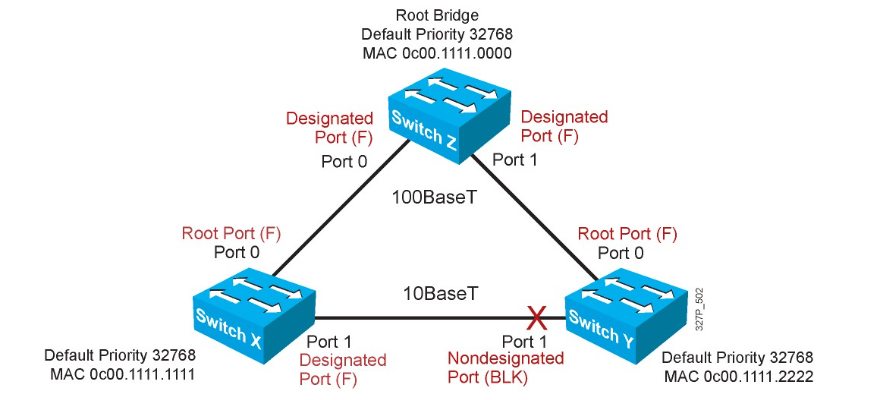

# 1. Giới thiệu  
- Spanning Tree Protocol định nghĩa trong chuẩn IEEE 802.1D. Spanning tree là giao thức không thể thiểu trong môi trường layer 2.
# 2.  Spanning là gì ?
- Khi switch nhận đươccj 1 frame, nó sẽ học source MAC vào bảng MAC address
- Tra Des MAC trong bảng MAC, ban đầu bảng MAC trắng nên nó sẽ flooded ra tất cả các cổng
- Theo mô hình, thì nó sẽ xảy ra hiện tượng  
  - Broadcast storm(bão quảng bá)
  - Instability MAC address table(bảng MAC không ổn định)
  - Multiple Frame copies(đa bản sao cùng một frame)

- Hiện tượng loop xảy ra khi các sw đấu nối theo 1 vòng khép kin 
- IEEE đưa ra chuẩn 802.1D(Spanning Tree Protocol) để chống loop. Về mặt luận lý thì nó sẽ khóa 1 port (Block port)

- Để tìm ra Block port cần trải qua các bước 
  - Bầu chọn Root Switch  
  - Bầu chọn Root port 
  - Bầu chọn Designated port
  - Port còn lại là ALternated Port
# 3. Ví dụ quá trình bầu chọn 
- Xem ví dụ về sơ đồ hoạt động STP như hình sau:

## 3.1 Bầu chọn Root Switch
- Khi các switch được đấu nối khởi động nó sẽ gửi gói tin BPDU (bridge protocol data unit) trên các port của switch
- Thông số quyết định sw nào được làm Root sw là Bridge-ID( 8byte) gồm có các thông số  
  - Priority (của switch)
    - Dài 2 byt, default = 32768
    - Switch nào có số priority có chỉ số nhỏ nhất sẽ được chọn là Root-Switch
  - MAC address switch 
    - Dài 6 byte 
    - Xét từ trái sang phải từng giá trị hexa thì switch nào có MAC nhỏ nhất làm Root-Switch
- Khi bầu xong Root-Switch thì chỉ có Root-Switch được gửi BPDU(2s/1 lần). Việc gửi đó để duy trì cây spanning tree đó không bị Loop
- Theo nguyên tắc đánh số MAC của nhà sản suất thì khi bầu chọn root-switch nó sẽ chọn switch đời đầu làm root-switch. Nên trong thực tế ta không bao giờ cho bầu chọn bằng MAC mà ta chỉnh priority.

## 5.2 Bầu chọn Root port

- Là port cung cấp đường về root-switch  mà có tổng path-cost nhỏ nhất
- Khi bầu chọn Root-switch thì Root-switch không tham  gia quá trình bàu chọn này  
- Mỗi non-root-switch  chỉ có một root-port 
- Path-cost là giá trị cost trên từng cổng của switch

Bandwidth | cost
---|---
10 Mbps| 100 
100 Mbps | 19
1 Gbps | 4
10 Gbps |2

- Nguyên tắc tính tổng path-cost: tính từ root-switch đến switch đang muốn tính  
  - Đi vào: cộng cost
  - Đi ra: không cộng

- Luật Tie-Break: sử dụng khi port  sw có  path-cost bằng nhau
  - Sender Bridge ID:
    - Cổng nào kết nối switch mà sw có bridge id nhỏ nhất -> port đó được chọn  làm root-port
  - Sender Port ID:
    - Port ID của Switch bên kia thì port nào của switch bên kia có giá trị port-ID nhỏ hơn thì chọn port bên switch mình kết nối với port ID nhỏ hơn đó.
      - **Priority của port**: có giá trị từ 0 -> 255, default=128. Port nào có priority nhỏ hơn thì port đó có Port ID nhỏ hơn.
      - **Vị trí của port**: Xét theo hạng của số thứ tự của port. Port số 1 < port 2 -> port số 1 làm root-port

- Khi các luật trên không giải quyết được thì nó sẽ xét đến Port ID trên chính nó
  - Priority và vị trí của port
## 5.3 Bầu chọn Designated port
- Tất cả port của root-switch đều là Designated port
- Trên 1 phân đoạn nếu port đối diện là root-port thì mình là Designated port(không có nghĩa ngược lại)
- Là port cung cấp đường về Root-switch trên phân đoạn mạng đang xét mà có tổng path-cost là nhỏ nhất

## 5.4 Bầu chọn Block port (Alternate port, port bị khóa)
- Khi một trong các phân đoạn khác bị đứt thì phân đoạn port block sẽ được mở ra để chạy  
- Khi phân đoạn  trên có lại thì phân đoạn block sẽ tiếp tục block lại
- Tuy port block không nhận được dữ liệu nhưng nó vấn nhận gói tin BPDU tù Root-switch để duy trì cây spanning-tree
- Kết quả sau 4 bước bầu chọn , cây STP hội tụ như sơ đồ sau  

## 5.5 STP timer
- Helo timer: định kì 2s sẽ gửi BPDU
- Forward timer: 15s
- Max-age times: 20s
Nếu Root-Switch chết hay port block không nhận được BPDU thì mất 20s nó mới hoạt động 
## 5.6  STP status 
- Disable: down
- Blocking: nhận BDPU, ko gửi BPDU, không học MAC, không forward frame
- Listening: nhận BDPU, gửi BPDU, không học MAC, không forward frame
- Leaning: nhận BDPU, gửi BPDU, học MAC, không forward frame
- Forwarding: nhận BDPU, gửi BPDU, học MAC, forward frame

+ Việc chuyển từ trạng thái 
  - Blocking sang Listening mất 20(s)
  - Listening sang Leaning mất 15(s) 
  - Leaning sang Forwarding mất 15(s)