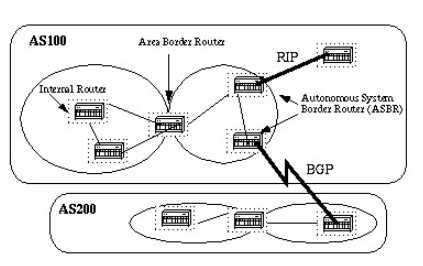

# 1. Giao thức OSPF
## 1.1 Khái niệm 
- Giao thức **Open Shortest Path First (OSPF)** được định nghĩa trong RFC 2328, là một giao thức định tuyến trong IGP được sử dụng để phân phối  thông tin định tuyến  trong một AS (Autonomous System. 
- Giao thức OSPF dựa trên công nghệ trạng thái đường link (link-state)
- Ưu điểm  
  - Không giới hạn hop count trong hệ thống mạng
  - Hỗ trợ VLSM
  - OSPF sử dụng gói tin multicast để gửi cập nhật trạng thái đường link. Cập nhật chỉ được gửi trong trường hợp có thay đổi định tuyến xảy ra thay vì cập nhật định kỳ. Điều này đảm bảo sử dụng băng thông tốt hơn
  - Bảng định tuyến hội tụ nhanh do các thay đổi định tuyến được lan truyền tức thời và không theo định kỳ
  - OSPF cho phép load balancing
## 1.2 Link States
- OSPF là link-states protocol. Ta có thể nghĩ một liên kết là một interface trên router. Trạng thái liên kết mô tả về interface đó và mối quan hệ của ó với các router lân cận
- Mô tả về interface bao gồm:
  - Địa chỉ IP của interdace
  - Mesk
  - Loại mạng được kết nối 
  - Các router được kết nối tới mạng đó  
  ....

- Tập hợp các trạng thái liên kết này sẽ tạo thành một cơ sở dữ liệu trạng thái liên kết 
## 1.3 Thuật toán Shortest Path First
- OSPF sử dụng thuật toán Shortest Path First (Dijkstra) để xây dựng và tính toán tuyến đường đi ngắn nhất tới mạng đích. Đây là thuật toán khá phức tạp. Cách đơn giản để xét các bước khác nhau  của thuật toán 
  - .Khi khởi tạo hoặc do bất kỳ thay đổi nào trong thông tin định tuyến, router sẽ tạo quảng bá trạng thái liên kết. Quảng bá này đại diện cho tập hợp tất cả các trạng thái liên kết trên router đó.
  - Tất cả các router trao đổi trạng thái liên kết bằng cách lũ lụt (flooding). Mỗi Router nhận được cập nhật trạng thái liên kết nên lưu trữ một bản sao trong cơ sở dữ liệu trạng thái liên kết của nó và sau đó truyền bản cập nhật đến các router khác.
  - Sau khi cơ sở dữ liệu của mỗi router hoàn tất, nó sẽ tính toán đường dẫn ngắn nhất đến tất cả các đích. Router sử dụng thuật toán Dijkstra để tính toán đường đi ngắn nhất. Các điểm đến, chi phí liên quan và bước nhảy tiếp theo để đến các điểm đến đó tạo thành bảng định tuyến
  - Trong trường hợp không có thay đổi nào trong mạng OSPF xảy ra, chẳng hạn như chi phí của một liên kết hoặc một mạng được thêm hoặc xóa, OSPF rất yên tĩnh. Mọi thay đổi xảy ra đều được truyền đạt thông qua các trạng thái liên kết và thuật toán Dijkstra được tính toán lại để tìm ra con đường ngắn nhất.
## 1.4 OSPF Cost
- Cost (còn gọi là metric) của một interface trong OSPF cho thấy chi phí cần thiết để gửi các gói tin qua một interface nhất định. Cost của một interface tỷ lệ nghịch với băng thông của interface đó. Băng thông càng cao cost càng thấp. Công thức được sử dụng để tính chi phí là:

        Cost = 100 000 000/bandwith (bps)

- Theo mặc định, cost của một interface được tính dựa trên băng thông; bạn có thể điều chỉnh cost của một interface bằng lệnh ip ospf cost

## 1.5 Area và Border Routers
- OSPF sử dụng lũ lụt để trao đổi các cập nhật trạng thái liên kết giữa các router.
- Mọi thay đổi trong thông tin định tuyến đều tràn vào tất cả các Router trong mạng.
-  Các Area được giới thiệu để đặt một ranh giới về sự bùng nổ của các cập nhật trạng thái liên kết. Ngập lụt và tính toán thuật toán Dijkstra trên router bị giới hạn trong một Area.
- Tất cả các router trong một area có cơ sở dữ liệu trạng thái liên kết chính xác.
- Router có thể thuộc nhiều area và kết nối các area này với backbone area (vùng xương sống) được gọi là Router biên (Area Border Routers - ABR).
- Do đó, ABR phải duy trì thông tin giữa backbone area và các Area kèm theo khác.

- Mỗi interface là một area cụ thể.  Một router có tất cả các interface của nó trong cùng một area được gọi là bộ định tuyến bên trong (Internal Router - IR)
- Một router có các interface khác nhau nằm trong nhiều area khác nhau được gọi là bộ định tuyến biên khu vực (Area Border Routers - ABR)
-  Router đóng vai trò là gateway (redistribution) giữa OSPF và các giao thức định tuyến khác (IGRP, EIGRP, IS-IS, RIP, BGP, static route) hoặc các tiến trình khác của giao thức định tuyến OSPF được gọi là bộ định tuyến ranh giới hệ thống tự trị (ASBR). Bất kỳ router nào cũng có thể là ABR hoặc ASBR.
## 1.6.  Hoạt động của OSPF
### 1.6.1. Chọn Router – id
- Khi router chạy OSPF thì phải có một giá trị duy nhất dùng để định danh cho router trong cộng đồng các router chạy OSPF. Giá triị này gọi là Router -id. Router-id trên router chạy OSPF có định dạng như một địa chỉ IP 
- Mặc định, tiến trình OSPF trên mỗi router sẽ tự động bầu chọn giá trị router – id là địa chỉ IP cao nhất trong các interface đang active, ưu tiên cổng loopback. Để đổi lại router – id của tiến trình, phải thực hiện khởi động lại router hoặc gỡ bỏ tiến trình OSPF rồi cấu hình lại, khi đó tiến trình bầu chọn router – id sẽ được thực hiện lại với các interface đang hiện hữu trên router.
- Có một cách khác để thiết lập lại giá trị router – id là sử dụng câu lệnh “router-id” để thiết lập bằng tay giá trị này trên router:

      Router (config) # router ospf 1
      Router (config-router) # router-id A.B.C.D
- Bên cạnh đó, nếu tiến trình OSPF đã chạy và router – id đã được thiết lập trước đó, ta phải khởi động lại tiến trình OSPF thì mới áp dụng được giá trị router – id mới được chỉ ra trong câu lệnh “router – id”. Câu lệnh khởi động lại tiến trình OSPF:

      Router (config) # clear ip ospf proccess
      Reset ALL OSPF proccess? [no]: yes
### 1.6.2 Thiết lập quan hệ láng giềng (neighbor)

- Router chạy OSPF sẽ gửi gói tin hello ra tất cả các cổng chạy OSPF, mặc định 10s/lần. Gói tin này được gửi đến địa chỉ multicast dành riêng cho OSPF là 224.0.0.5, đến tất cả các router chạy OSPF khác trên cùng phân đoạn mạng. Mục đích của gói tin hello là giúp cho router tìm kiếm láng giềng, thiết lập và duy trì mối quan hệ này
### 1.6.3 Trao đổi LSDB

- LSDB(Link states database) là một tấm bản đồ mạng và router sẽ căn cứ vào đó để tính toán định tuyến. LSDB phải hoàn toàn giống nhau giữa các router cùng vùng. Các router sẽ không trao đổi với nhau cả một bảng LSDB mà sẽ trao đổi với nhau từng đơn vị thông tin gọi là LSA – Link State Advertisement. Các đơn vị thông tin này lại được chứa trong các gói tin cụ thể gọi là LSU – Link State Update mà các router thực sự trao đổi với nhau.
### 1.6.4. Tính toán xây dựng bảng định tuyến

Metric = cost = 10^8/Bandwidth (đơn vị bps)

Ethernet (BW = 10Mbps) → cost = 10

Fast Ethernet (BW = 100Mbps) → cost = 1

Serial (BW = 1.544Mbps) → cost = 64 (bỏ phần thập phân trong phép chia).

# 2. Giao thức EIGRP  
## 2.1 Định nghĩa  
- **EIGRP – Enhance Interio Gateway Routing Protocol** là giao thức định tuyến mở rộng của IGRP, IGRP là giao thức dạng Classfull, còn EIGRP là giao thức dạng Classless, nghĩa là có mang theo subnetmask trong các lần cập nhật EIGRP là giao thức định tuyến lai (Hybrid Routing), là sự kết hợp của Distance Vector và Link States. EIGRP là một giao thức định tuyến theo vector khoảng cách nâng cao nhưng khi cập nhật và bảo trì thông tin láng giềng và thông tin định tuyến thì nó làm việc giống như một giao thức định tuyến theo trạng thái đường liên kết.
-  Ưu điểm của EIGRP so với các giao thức định tuyến véc tơ khoảng cách
  - Khả năng hội tụ nhanh
  - Bảo tồn băng thông và sử dụng băng thông một cách hiệu quả
  - Hỗ trợ VLSM (Veriable Length Subnet Mask) và CIDA (Classles Inter Domain Routing). Không giống như IGRP,EIGRP có thể trao đổi thông tin ở các IP khác lớp mạng
  -  Hỗ trợ IP, IPX, Apple talk: vì Talk nhờ có cấu trúc từng phần theo giao thức (PDMs – Protocok dependent modules). EIGRP có thể phân phối thông tin của IPX,RIP để cải tiến hoạt động toàn diện. 
  - Chạy trực tiếp trên IP và protocol number là 88
  - Load balancing trên tất cả các cost không bằng nhau
  - Hỗ trợ tất cả các giao thức và cấu trúc dữ liệu ở layer 2
  - Không dùng broadcast và dùng Multicast hoặc Unicast trong từng trường hợp cụ thể
  - Hỗ trợ việc chứng thực
  - Manual Summary trên bất kỳ interface nào
- Nhược điểm
  - EIGRP là một giao thức với rất nhiều ưu điểm và có thể được sử dụng trong những mô hình mạng vừa và lớn tuy nhiên vì đây là giao thức độc quyền của Cisco nên nó chỉ chạy trên thiết bị của cisco, trong khi đó không phải một tổ chức nào cũng có thể dùng toàn đồ Cisco mà còn các dòng sản phẩm khác nữa. Chính vì vậy, đây là một bất lợi của giao thức định tuyến EIGRP.
## 2.2 Nguyên lý hoạt động

- EiGRP router lưu giữ các thông tin về đường đi và cấu trúc mạng trên RAM, nhờ đó chúng đáp ứng nhanh chóng theo sự thay đổi. 
Giống như OSPF, EIGRP cũng lưu thông tin thành từng bảng và từng cơ sở dữ liệu khác nhau. EIGRP  lưu các con đường mà nó học được theo một cách đặc biệt. Mỗi con đường có trạng thái riêng và đánh dấu để cung cấp thêm nhiều thông tin hữ dụng khác  
- Topology exchange: Những Router neighbor sẽ trao đổi thông tin lẫn nhau, cập nhật đầy đủ cấu trúc liên kết, topology mạng. Khi topoly mạng thay đổi nó sẽ cập nhật phần thay đổi.
- Choosing routes: Mỗi Router sẽ tiến hành phân tích bảng EIGRP topology table, chọn ra con đường định tuyến có metric tốt để đến các subnet. Sau khi thực hiện 3 bước ở trên, hệ điều hành IOS sẽ lưu 3 bảng EIGRP Tables quan trọng:

  + Bảng láng giềng (Neighbor table): Bảng láng giềng là bảng quan trọng nhất của EIGRP, trong đó có danh sách các router thân mật với nó. Đối với mỗi giao thức mà EIGRP hỗ trợ thì nó sẽ có 1 bảng láng giềng tương ứng. Khi phát hiện một láng giềng mới, router sẽ ghi lại thông tin về địa chỉ, cổng kết nối.

  + Bảng cấu trúc mạng (Topology table): Là bảng cung cấp dữ liệu để xây dựng nên bảng định tuyến của EIGRP. Thuật toán DUAL sẽ lấy thông tin từ bảng láng giềng và bảng cấu trúc để chọn đường có chi phí thấp nhất cho từng mạch đích. Mỗi EIGRP Router lưu một bảng cấu trúc mạng riêng tương ứng với từng loại giao thức mạng khác nhau. Bảng cấu trúc mạng chứa thông tin về tất cả các con đường mà Router học được. Nhờ những thông tin này mà Router có thể xác định đường đi khác để thay thế nhanh chóng khi cần thiết. Thuật toán DUAL chọn ra đường tốt nhất đến mạng đích gọi là đường kính (successor Router).
## 2.3 Những thông tin chứa trong bảng cấu trúc
- Feasible Distance (FD): Là thông tin định tuyến nhỏ nhất mà EIGRP tính được cho từng mạch đích

- Router Sourch: Là nguồn phát khởi thông tin về một nguồn nào đó, phần thông tin này chỉ có đối với những kết nối ngoài mạng EIGRP

- Reported Distance (RD): Là thông số định tuyến đến 1 Router láng giềng được thông báo qua

- Thông tin về cổng giao tiếp mà Router sử dụng để đi đến mạch đích

- Trạng thái đường đi: Trạng thái không tác động (P-Passive) là trạng thái ổn định, sẵn sàng sử dụng được, trạng thái tác động(A-active) là trạng thái đang trong tiến trình tính toán lại của DUAL.

- Bảng định tuyến (Routing table): Bảng định tuyến EIGRP lưu giữ danh sách các đường tốt nhất đến các mạng đích. Những thông tin trong bảng định tuyến được rút ra từ bảng cấu trúc mạng.

- Router EIGRP có bảng định tuyến riêng cho từng giao thức mạng khác nhau. Con đường được chọn làm đường chính đến mạng đích gọi là successor. Từ thông tin trong bảng láng giềng và bảng cấu trúc mạng, DUAL chọn ra một đường chính và đưa lên mạng định tuyến. Đến một mạng đích có thể có đến 4 successor. Những đường này có chi phí bằng nhau hoặc không bằng nhau.
- Thông tin về successor cũng được đặt trong bảng cấu trúc mạng. Đường Feasible successor (FS) là đường dự phòng cho đường successor. Đường này cũng được chọn ra cùng với đường successor nhưng chúng chỉ được lưu trong bảng cấu trúc mạng nhưng điều này không bắt buộc. Router xem hop kế tiếp của đường Feasible successor dưới nó gần mạng đích hơn nó. Do đó, chi phí của Feasbile successor được tính bằng chi phí của chính nó cộng với chi phí vào Router láng giềng thông báo qua.

# Tham khảo 
- https://vnpro.vn/thu-vien/giao-thuc-open-shortest-path-first-ospf-3193.html
- https://vnpro.vn/thu-vien/cau-hinh-dinh-tuyen-dong-ospf-2351.html
- https://vnpro.vn/thu-vien/so-luoc-ve-giao-thuc-dinh-tuyen-eigrp-2055.html

