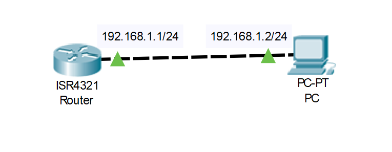
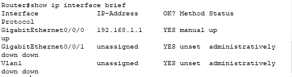
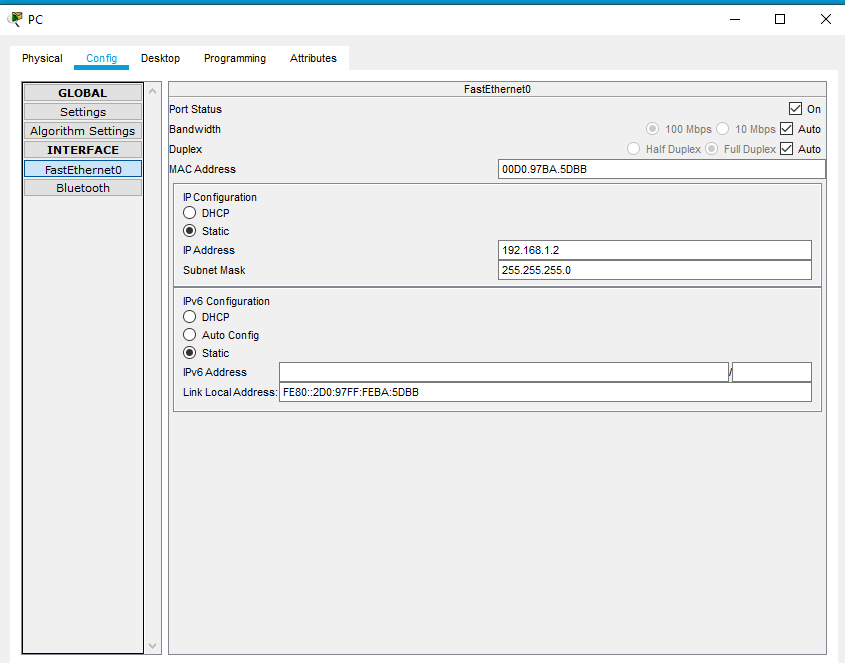
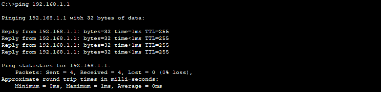

# 1. Giao diện dòng lệnh của router
- **User EXEC mode**: chỉ có thể sử dụng các lệnh hiển thị cơ bản, không thể can hiệp vào cấu hình của router
- **Privilege mode**: thực hiện câu lệnh hiển thị bất kì mọi thông số của route, có quyền đi đến bất kì mode tiếp theo của route, chưa thực hiện cấu hình được router
- **Global configgunation mode**: có thể cấu hình cho route, thay đổi cấu hình của route
- **Sub-mode**: thực hiện cấu hình riêng cho từng phần con, nhưng từng port trên route
- **exit**: thoát khoi mode
```
Router>               #user EXEC mode
Router>enable  
Router#               #Privilege mode
Router#config terminal 
Enter configuration commands, one per line.  End with CNTL/Z.
Router(config)#       #Global configunation mode
Router(config)#int gig0/0
Router(config-if)#    # Sub-mode
```


- Một số lệnh cơ bản
  - Đổi tên router
    
        Router(config)#hostname R_1
        R_1(config)#

  - Đặt password cho router

        Router(config)#enable password ccna
        ...
        R_1>enable 
        Password: 
  - Xem cấu hình đang chạy trên router

        R_1#show running-config
  - Đặt password cho cổng console  
        
        R_1(config)#line console 0
        R_1(config-line)#password cisco
        R_1(config-line)#login

  - Mã hóa password tránh hiển thị trong file cấu hình  

        R_1#service password-encryption

  - Hiển thị các cổng trên một router

        R_1#show ip interface brief

  - Lưu cấu hình đã tạo  

        R_1#copy running-config startup-config 
# 2. Lab   
- Bài lap thực hiện trên Cisco Packet Tracer
- Mô hình  



- Cấu hình trên router
```
Router#
Router#configure terminal
Enter configuration commands, one per line.  End with CNTL/Z.
Router(config)#interface GigabitEthernet0/0/0
Router(config-if)#exit
Router(config)#interface GigabitEthernet0/0/0
Router(config-if)#exit
Router(config)#interface GigabitEthernet0/0/0
Router(config-if)#exit
Router(config)#interface GigabitEthernet0/0/0
Router(config-if)#exit
Router(config)#interface GigabitEthernet0/0/0
Router(config-if)#exit
Router(config)#interface GigabitEthernet0/0/0
Router(config-if)#no shutdown
%LINK-5-CHANGED: Interface GigabitEthernet0/0/0, changed state to up

%LINEPROTO-5-UPDOWN: Line protocol on Interface GigabitEthernet0/0/0, changed state to up

Router(config-if)#exit
Router(config)#interface GigabitEthernet0/0/0
Router(config-if)#ip address 192.168.1.1 255.255.255.0

```


- Cấu hình trên PC
  - Cấu hình ip và mở port trên PC 
  

- Thực hiện ping từ pc đến router
  

