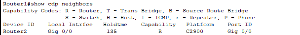
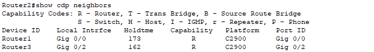
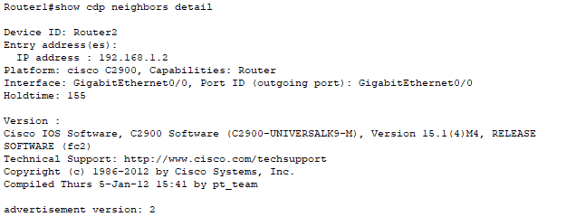
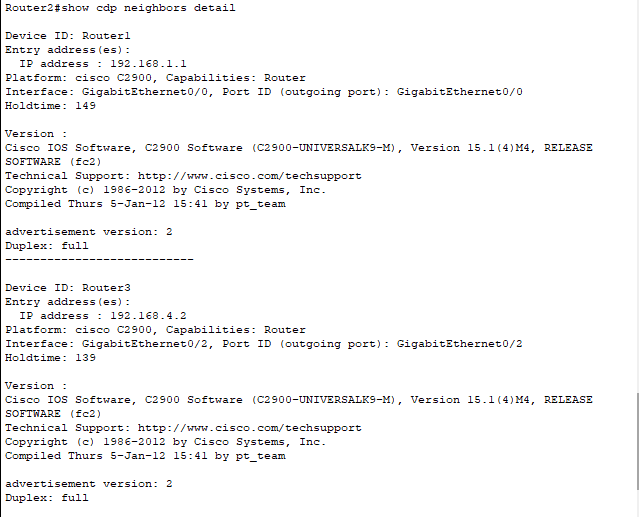
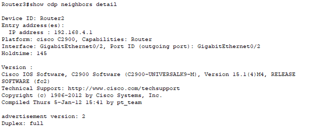
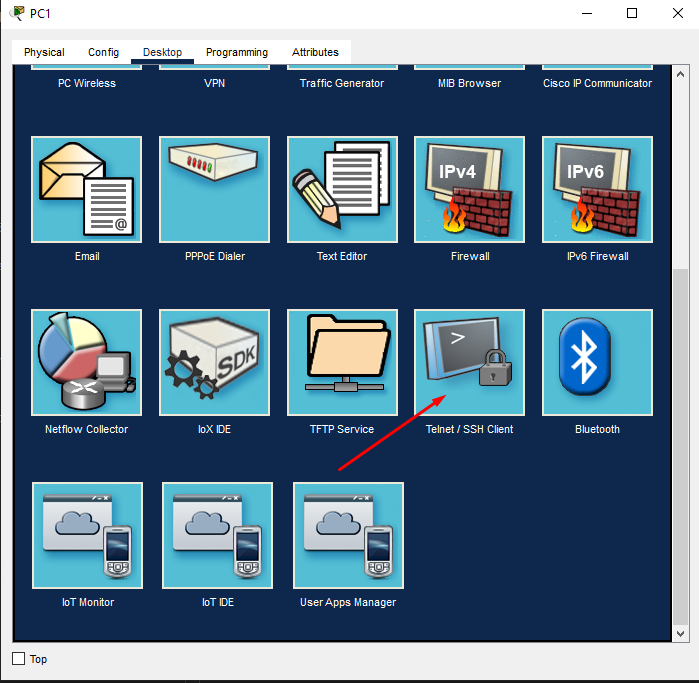
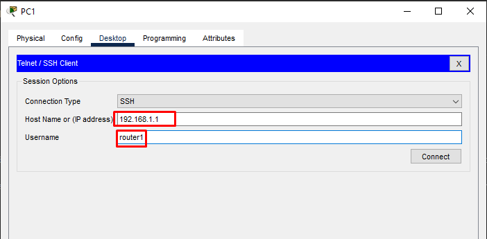
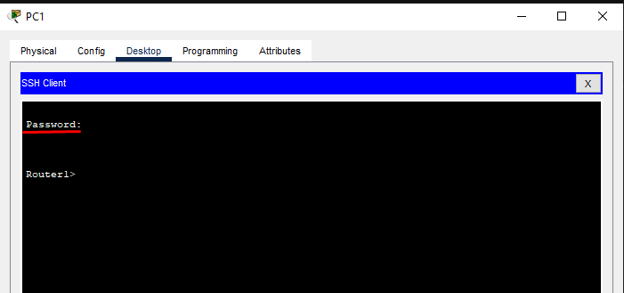

# 1. Mô hình  


# 2. Ip planning

Hostname  | interface | IP | gateway
---|---|---|---
Router1| Gi0/0|192.168.1.1/24
||Gi0/1 | 192.168.2.1/24
Router2| Gi0/0|192.168.1.2/24
||Gi0/1 | 192.168.3.1/24
PC1| Fa0|192.168.2.2/24 |192.168.2.1
PC2| Fa0|192.168.3.2/24 |192.168.3.1

# 3. Cấu hình  
## Đặt địa chỉ Ip và interface 

**Router1**

- Thực hiện mở interface F0/0 và đặt địa chỉ ip 
```
Router1(config)#interface GigabitEthernet0/0
Router1(config-if)#no shutdown
%LINK-5-CHANGED: Interface GigabitEthernet0/0, changed state to up

%LINEPROTO-5-UPDOWN: Line protocol on Interface GigabitEthernet0/0, changed state to up
Router1(config-if)#ip address 192.168.1.1 255.255.255.0


Router1(config)#interface GigabitEthernet0/1
Router1(config-if)#no shutdown
%LINK-5-CHANGED: Interface GigabitEthernet0/0, changed state to up

%LINEPROTO-5-UPDOWN: Line protocol on Interface GigabitEthernet0/0, changed state to up
Router1(config-if)#ip address 192.168.2.1 255.255.255.0
```
**Router2**
- Thực hiện mở interface F0/1 và đặt địa chỉ ip 


```
Router2(config)#interface GigabitEthernet0/0
Router2(config-if)#no shutdown
%LINK-5-CHANGED: Interface GigabitEthernet0/0, changed state to up

%LINEPROTO-5-UPDOWN: Line protocol on Interface GigabitEthernet0/0, changed state to up
Router2(config-if)#ip address 192.168.1.2 255.255.255.0


Router2(config)#interface GigabitEthernet0/1
Router2(config-if)#no shutdown
%LINK-5-CHANGED: Interface GigabitEthernet0/0, changed state to up

%LINEPROTO-5-UPDOWN: Line protocol on Interface GigabitEthernet0/0, changed state to up
Router2(config-if)#ip address 192.168.3.1 255.255.255.0
```

**PC1**


**PC2**


## Thực hiện định tuyến trên router

- Trên Router1 định tuyến cho phép mạng 192.168.3.0/24 được gửi tin đến thông qua cổng 192.168.1.2 

      Router1(config)#ip route 192.168.3.0 255.255.255.0 192.168.1.2
- Trên Router2 định tuyến cho phép mạng 192.168.2.0/24 được gửi tin đến thông qua cổng 192.168.1.1

      Router2(config)#ip route  192.168.2.0 255.255.255.0 192.168.1.1

- Thực hiện ping từ PC1 đến PC2


- Thực hiện ping từ PC2 đến PC1


# 4. Sử dụng giao thức CDP để nhận dạng các router được hết nối đến
- Hiển thị mặc định
  - **Router1**


  - **Router2**


  - **Router3**


- Hiển thị chi tiết hơn  
  - **Router1**


  - **Router2**


  - **Router3**
  



# 5. Cấu hình ssh cho router

- Thực hiện trên Router1
```
Router1(config)#ip domain-name example.com
Router1(config)#username router1 password vnpt
Router1(config)#crypto key generate rsa
The name for the keys will be: Router1.example.com
Choose the size of the key modulus in the range of 360 to 2048 for your
  General Purpose Keys. Choosing a key modulus greater than 512 may take
  a few minutes.

How many bits in the modulus [512]: 
% Generating 512 bit RSA keys, keys will be non-exportable...[OK]

Router1(config)#line vty 0 4 
*Mar 1 1:16:47.169: RSA key size needs to be at least 768 bits for ssh version 2
*Mar 1 1:16:47.169: %SSH-5-ENABLED: SSH 1.5 has been enabled
Router1(config-line)#login local
Router1(config-line)#transport input ssh
```

- Trên PC1 thực hiện ssh đến Router1
  - Chọn cửa sổ telnet/ssh client 

  
  - Nhập hostname(IP) và user


  -  Nhập password



