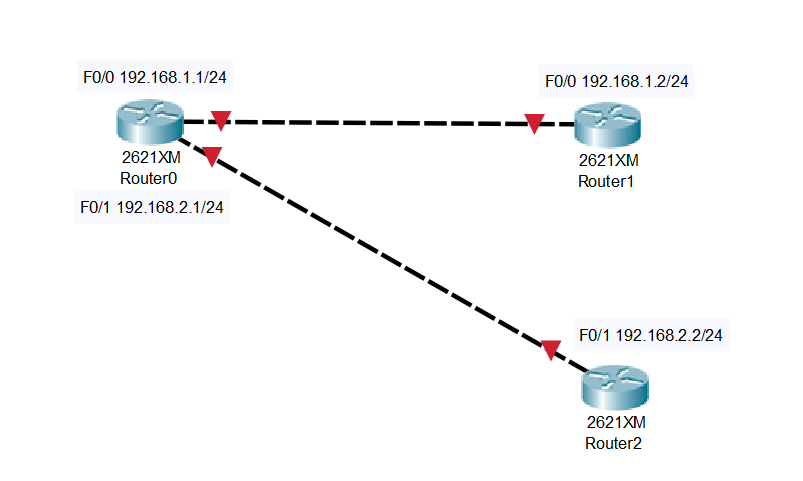

# 1. Mô hình  


# 2. Ip planning

Hostname  | interface | IP 
---|---|---
Router0| F0/0|192.168.1.1/24
||F0/1 | 192.168.2.1/24
Router2| F0/0|192.168.1.2/24
Router3| F0/1|192.168.1.2/24


# 3. Cấu hình  
## Trên Router0
- Thực hiện mở interface F0/0 và đặt địa chỉ ip 

```
Router0(config)#interface FastEthernet0/0
Router0(config-if)#no shutdown
Router0(config-if)#
%LINK-5-CHANGED: Interface FastEthernet0/0, changed state to up
Router0(config-if)#ip address 192.168.1.1 255.255.255.0
```
- Thực hiện mở interface F0/1 và đặt địa chỉ ip 
```
Router0(config)#interface FastEthernet0/1
Router0(config-if)#no shutdown
Router0(config-if)#
%LINK-5-CHANGED: Interface FastEthernet0/1, changed state to up
Router0(config-if)#ip address 192.168.2.1 255.255.255.0
```
## Trên Router1
- Thực hiện mở interface F0/0 và đặt địa chỉ ip 
```
Router1(config)#interface FastEthernet0/0
Router1(config-if)#no shutdown
Router1(config-if)#
%LINK-5-CHANGED: Interface FastEthernet0/0, changed state to up

%LINEPROTO-5-UPDOWN: Line protocol on Interface FastEthernet0/0, changed state to up
ip address 192.168.1.2 255.255.255.0
Router1(config-if)#ip address 192.168.1.2 255.255.255.0
```