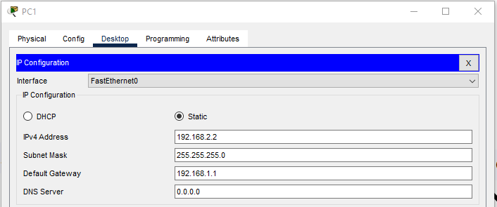
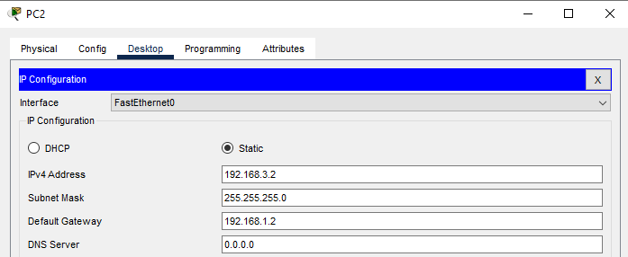
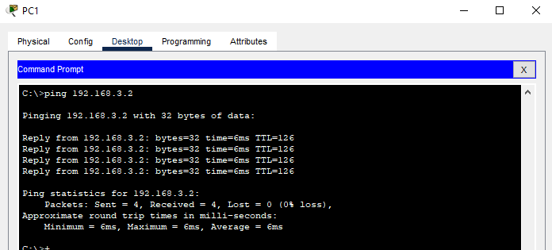
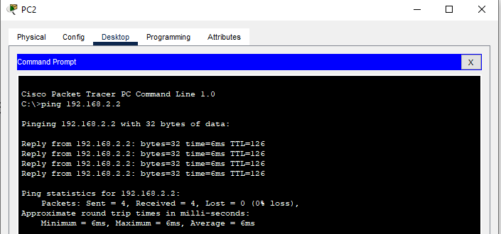

# 1. OSPF
## 1.1 Mô hình  


## 1.2  Ip planning

Hostname  | interface | IP | gateway
---|---|---|---
Router1| Gi0/0|192.168.1.1/24
||Gi0/1 | 192.168.2.1/24
Router2| Gi0/0|192.168.1.2/24
||Gi0/1 | 192.168.3.1/24
PC1| Fa0|192.168.2.2/24 |192.168.2.1
PC2| Fa0|192.168.3.2/24 |192.168.3.1

## 1.3 Cấu hình 
- Chạy ospf 
    
      Router1(config)#router ospf 1
      Router1(config-router)#network ip wildcard-mask area 0
>wildcard-mask = 255.255.255.255 - subnet mask

-  **Trên Route1**
````
Router1(config)#router ospf 1
Router1(config-router)#network 192.168.1.0 0.0.0.255 area 0
Router1(config-router)#network 192.168.2.0 0.0.0.255 area 0
````
  - **Trên Route2**
````
Router2(config)#router ospf 1
Router2(config-router)#network 192.168.1.0 0.0.0.255 area 0
Router2(config-router)#network 192.168.3.0 0.0.0.255 area 0
````

  - **PC1**


  - **PC2**


- Thực hiện ping từ PC1 đến PC2



- Thực hiện ping từ PC2 đến PC1


## 1.4 Một số câu lệnh 
- Hiệu chỉnh OSPF
  - Router-id 

        Router1(config-router)#router-id 192.168.2.1
        Router1#clear ip ospf process
  - Priority
    - Vào cổng sử dụng ospf nhập 

          Router1(config-if)#ip ospf priority [0-255]
  - Hello timer 

        Router1(config-if)#ip ospf hello-interval [time(s)]
        Router1(config-if)#ip ospf dead-interval [time(s)]

  - Giá trị cost 

        Router1(config-if)#ip ospf cost [giá trị]
  - Xác thực 
    
        Router1(config-if)#ip ospf authentication [message-digest|null]
        Router1(config-if)#ip ospf authentication-key [key]

- Lệnh show
  - Router1#show ip route ospf
  - Router1#show ip ospf neighbor
  - Router1#show ip ospf database
  - Router1#show ip ospf interface
  - Router1#show ip protocols