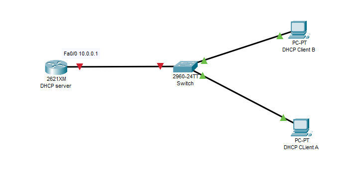
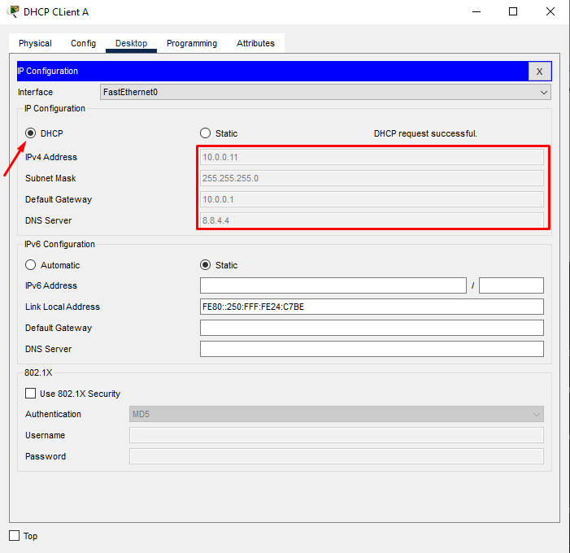

# 1. Topology

- Yêu cầu 
  - Cấu hình DHCP server cấp địa chỉ tự động cho DHCP client A
  - Cấu hình DHCP server cấp địa chỉ ip cố định cho DHCP client B
# 2. Cấu hình  
## 2.1 Cấu hình DHCP server cấp địa chỉ tự động cho DHCP client A
- Cấu hình trên Router 
  - Đặt địa chỉ DHCP trên cổng fa0/0 là 10.0.0.1 

```
Router(config)#int f0/0
Router(config-if)#ip address 10.0.0.1 255.255.255.0 
Router(config-if)#no shutdown 
%LINK-5-CHANGED: Interface FastEthernet0/0, changed state to up

%LINEPROTO-5-UPDOWN: Line protocol on Interface FastEthernet0/0, changed state to up
```
  - Bật dịch vụ DHCP trên router

        Router(config)#service dhcp

  - Tạo pool để cấp IP đến LAN  và đặt địa chỉ mạng 

        Router(config)#ip dhcp pool NETWORK_10
        Router(dhcp-config)#network 10.0.0.0 255.255.255.0 
  - Đặt default gateway cho router(cổng được kết nối tới mạng LAN)

        Router(dhcp-config)#default-router 10.0.0.1
  - Đặt DNS-server 

        Router(dhcp-config)#dns-server 8.8.8.8 
        Router(dhcp-config)#dns-server 8.8.4.4
  - Đặt thời hạn IP được cấp phát 

        Router(dhcp-config)#lease day hours minitune
         
  - Thực hiện loại bỏ dải ip không muốn DHCP cấp cho mạng LAN 

        Router(config)#ip dhcp excluded-address 10.0.0.1 10.0.0.10
- Cấu hình trên DHCP Client A 

  - Bật dịch vụ dhcp trên PC để nhận cấu hình DHCP

  - Ta thấy địa chỉ ip của PC đã được cập nhập và bỏ qua các địa chỉ  10.0.0.1-10.0.0.10

- Quá trình truyền gói tin thông qua DHCP

## 2.2 Cấu hình DHCP server cấp địa chỉ ip cố định cho DHCP client B

- Cấu hình trên Router 
  - Tạo pool cấp IP cho DHCP client B

        Router(config)#ip dhcp pool PCB

  - Nhập địa chỉ cấp cho host 

        