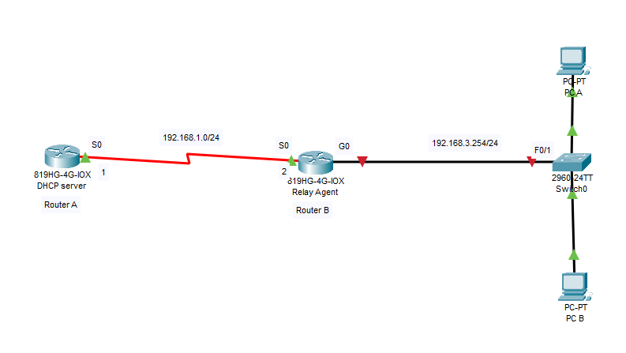
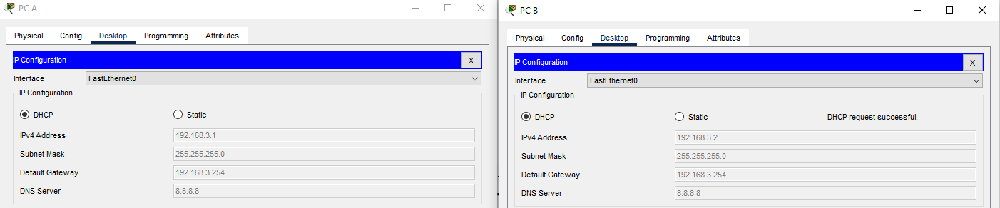
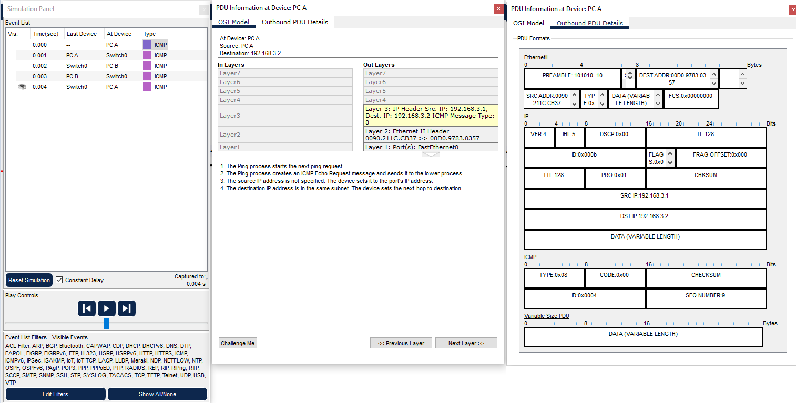
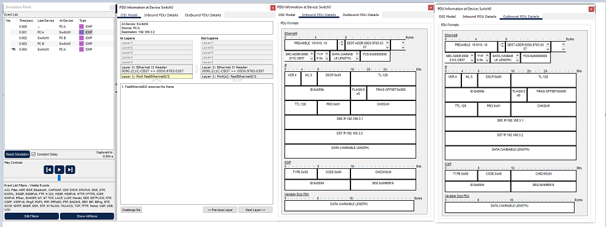
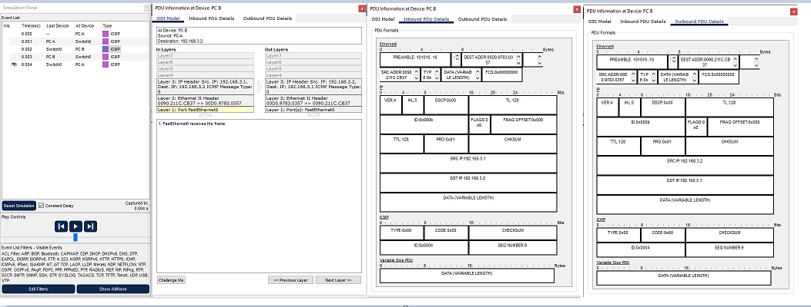
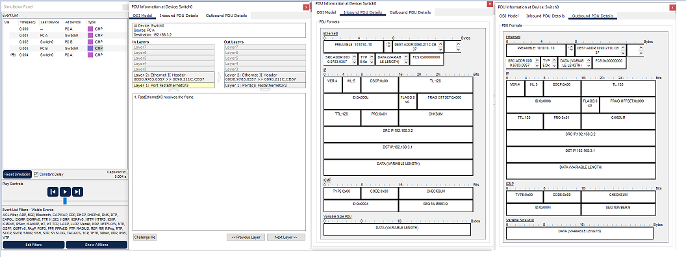

# 1. Topology


- Yêu cầu 
  - Cấu hình router thành DHCP relay agent trong một mạng IP động khi DHCP server không nằm trong mạng này  
# 2. Cấu hình  
- Cấu hình router A
  - Cấu hình địa chỉ ip cho cổng s0 
  ```
  Router(config)#interface Serial0
  Router(config-if)#no shutdown
  Router(config-if)#ip address 192.168.1.1 255.255.255.0
  Router(config-if)#clock rate 64000
  ```
  - Đặt clock rate cho  router để đặt làm DCE (Kết nối serial cần một thiết bị làm DCE và thiết bị còn lại làm DTE, cần đặt clock rate trên DCE để đảm bảo xung nhịp cho tốc độ truyền dẫn)
  -  Cấu hình định tuyến rip trên router A
  ```
  Router(config)#router rip
  Router(config-router)#network 192.168.1.0
  Router(config-router)#version 2 
  Router(config-router)#no auto-summary 
  ```
- Cấu hình Router B
  - Cấu hình địa chỉ ip cho cổng s0 
  ```
  Router(config)#interface Serial0/0
  Router(config-if)#ip address 192.168.1.2 255.255.255.0
  Router(config-if)#no shutdown
  ```
  - Cấu hình địa chỉ ip cho cổng F0  
  ```
  Router(config)#interface FastEthernet0/0
  Router(config-if)#ip address 192.168.3.254 255.255.255.0
  Router(config-if)#no shutdown
  ```

  -  Cấu hình định tuyến rip trên router B
  ```
  Router(config-router)#version 2
  Router(config-router)#network 192.168.1.0
  Router(config-router)#network 192.168.3.0
  Router(config-router)#no auto-summary 
  ```

- Thực hiện ping từ router A đến 192.168.3.254

```
Router#ping 192.168.3.254

Type escape sequence to abort.
Sending 5, 100-byte ICMP Echos to 192.168.3.254, timeout is 2 seconds:
!!!!!
Success rate is 100 percent (5/5), round-trip min/avg/max = 5/7/9 ms
```

- Cấu hình DHCP server cho router A 
```
Router(config)#service dhcp 
Router(config)#ip dhcp pool network192.168.3.0
Router(dhcp-config)#network  192.168.3.0 255.255.255.0
Router(dhcp-config)#default-router 192.168.3.254
Router(dhcp-config)#dns-server 8.8.8.8
Router(config)#ip dhcp excluded-address 192.168.3.200 192.168.3.254
```
- Cấu hình trên router B
```
Router(config)#interface FastEthernet0/0
Router(config-if)#ip helper-address 192.168.1.1 
Router(config-if)#exit
Router(config)#service dhcp 
```
- Trên PC A và  PC B thực hiện bật cấu hình DHCP 


- Ta thấy PC A và PC B đã nhận địa chỉ IP của mạng 192.168.3.0/24
- Quá trình chuyền tin từ PC A đến PC B  







