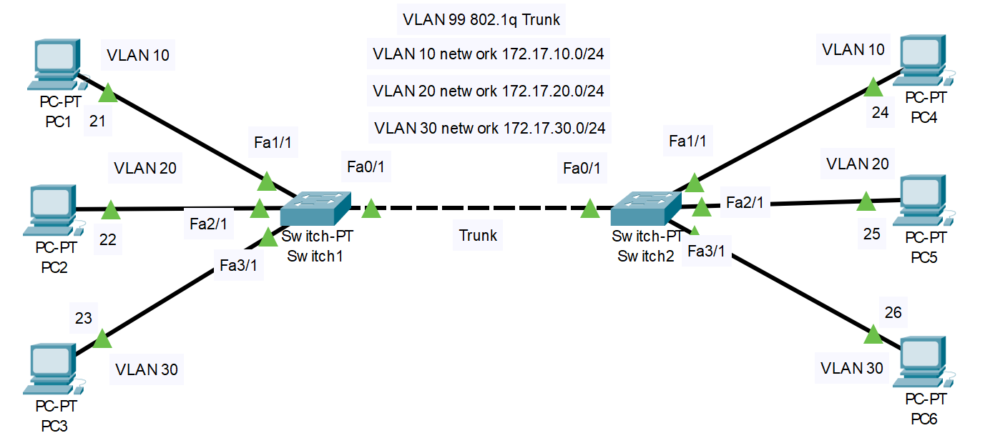
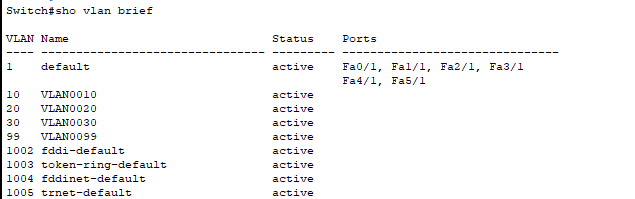
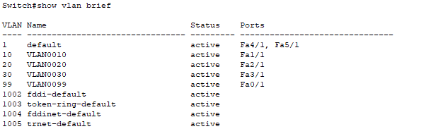
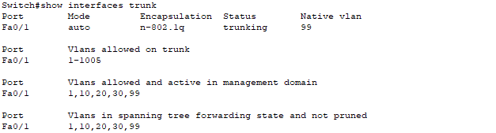
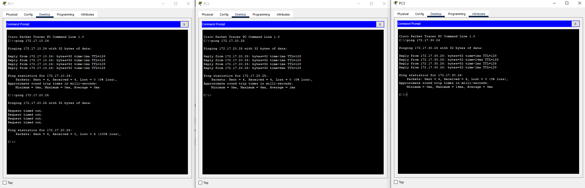

# 1. Topology


# 2. Cấu hình  
- Thực hiện tạo vlan10 vlan20 vlan30 vlan99  trên 2 switch 
```
Switch(config)#vlan 10
Switch(config-vlan)#vlan 20
Switch(config-vlan)#vlan 30
Switch(config-vlan)#vlan 99
Switch(config-vlan)#
```
- Ta có bảng vlan trên 2 sw


- Thực hiện gán vlan cho các interface  trên 2 switch
```
Switch(config)#interface FastEthernet0/1 
Switch(config-if)#switchport access vlan 99
Switch(config-if)#exit
Switch(config)#interface FastEthernet1/1
Switch(config-if)#switchport access vlan 10
Switch(config-if)#exit
Switch(config)#interface FastEthernet2/1
Switch(config-if)#switchport access vlan 20
Switch(config-if)#exit
Switch(config)#interface FastEthernet3/1 
Switch(config-if)#switchport access vlan 30
```
- Ta có bảng vlan trên 2 sw



- Tạo đường Trunking giữa 2 switch sử dụng vlan 99 
```
Switch(config)#int f0/1
Switch(config-if)#switchport trunk native vlan 99
```
- Kiểm tra đường trunk 



- Thực hiện ping trong từng vlan


